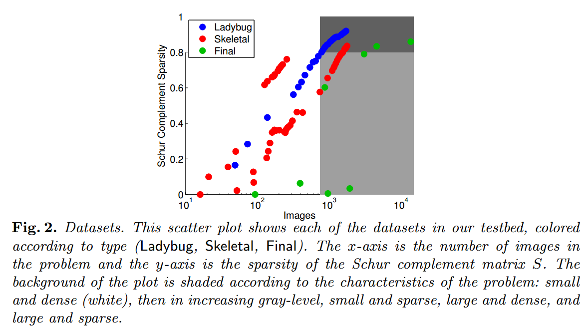
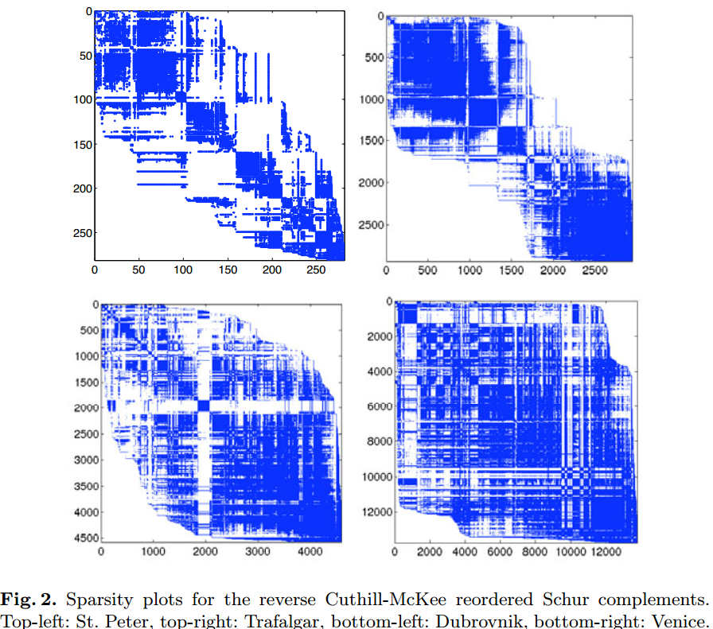

# Bundle Adjustment

## 1. Schur Complement
## 2.  Precontioned Conjugate Gradient

考虑 Normal Equation:

$$
\left[
  \begin{array}{cc}
    \mathbf{B} & \mathbf{E} \\
    \mathbf{E}^T & \mathbf{B}
  \end{array}
\right]
\left[
    \begin{array}{c}
    \Delta \mathbf{y} \\ 
    \Delta \mathbf{z}
    \end{array}
\right] =
\left[
  \begin{array}{c}
    \mathbf{y} \\
    \mathbf{w}  
  \end{array}
\right]
$$

$\mathbf{C}$ 的 Schur Complement 为 $\mathbf{S} = \mathbf{B} - \mathbf{E} \mathbf{C}^{-1} \mathbf{E}^T$,
***Reduced Camera System*** 为 $\mathbf{S} \Delta \mathbf{y} = \mathbf{v} - \mathbf{E} \mathbf{C}^{-1} \mathbf{w}$.
我们有如下几种方法求解 Reduced Camera System:
(1) **直接法**. 由于 $\mathbf{S}$ 为对称正定阵, 因此我们可以采用 Cholesky Decomposition 来求解. 直接法又分为以下两种方法:
- Dense Factorization. 稠密分解的空间复杂度为 $O(p^2)$, 时间复杂度为 $O(p^3)$.
- Sparse Factorization. 稀疏分解法需要对行和列进行重新排列来最大化 Cholesky Decomposition 的稀疏性. 这种方法也依赖 $\mathbf{S}$ 的稀疏结构.

(2) **非直接法**, 或者称为 **Inexact Linear Solver**. LM 算法是迭代算法, 因此有的认为, 在每一步迭代里都去计算一个精确解是没有必要的. 与此相反, 我们可以通过构造一个优化问题来寻求一个近似解. 这也被称作 ***Inexact/Truncated Newton Method***. 对于非精确牛顿法, 有两个需要关注的点: 1) 合适的迭代求解器; 2) 终止准则. 我们在 BA 里一般采用 **共轭梯度法** (Conjugate Gradient). 接下来我们便要考虑如何在 LM 的每一步迭代里进行求解.

对于 Normal Equation $\mathbf{H}_{\mu} \Delta \mathbf{x} = -\mathbf{g}$, 共轭梯度的收敛性取决于 $\mathbf{H}_{\mu}$ 的条件数 $\kappa (\mathbf{H}_{\mu})$. 条件数的一个上确界是 $\kappa (\mathbf{H}_{\mu}) = \sqrt{\kappa (\mathbf{J}^T \mathbf{J})}$. 如果我们直接用共轭梯度法求解 Normal Equation 的话, 由于 $\mathbf{H}_{\mu}$ 的条件数太大会导致性能很差. 那么怎么来解决这个问题呢? 这时候, 带着拯救万千算法工程师的使命与责任, 我们的 ***preconditioner*** 出场了.

### 2.1 关于 Preconditioner
对于 linear system $\mathbf{A} \mathbf{x} = \mathbf{b}$, 我们对等式左右两边同乘 preconditioner $\mathbf{M}$ 的逆, 得到preconditioned linear system $\mathbf{M}^{-1} \mathbf{A} \mathbf{x} = \mathbf{M}^{-1} \mathbf{b}$. 使用了 preconditioner 的共轭梯度算法则被称为 ***Preconditioned Conjugate Gradient (PCG)*** . 对于 PCG, 条件数变为了 $\kappa (\mathbf{M}^{-1} \mathbf{A})$. 前面讲到, linear system 的求解性能和条件数高度相关. 因此, 现在的问题变成了: 如何构造 preconditioner, 来使得条件数越小越好? 下面我们来分情况讨论.

- 一个最理想的 preconditioner 是 $\mathbf{M} = \mathbf{A}$, 这样的话条件数变为了 $\kappa (\mathbf{M}^{-1} \mathbf{A}) = \kappa (\mathbf{I}) = 1$.
但是, 选择 $\mathbf{A}$ 为条件数会导致求逆运算, 进而导致时间复杂度非常高.

- 一个最简单的 preconditioner 是 diagonal 或 Jacobi preconditioner, 如 $\mathbf{M} = diag(\mathbf{A}) = diag(\mathbf{H}_{\mu})$, 该 
preconditioner 称为 ***Block Diagonal Jacobi Preconditioner*** ($\mathbf{M}_{J}$). 由于 $\mathbf{H}_{\mu}$ 的对角块 $\mathbf{B}, \mathbf{C}$ 都是
块对角矩阵, 因而 

$$
\mathbf{M}_{J} = 
\left[
  \begin{array}{cc}
    \mathbf{B} & \mathbf{0} \\
    \mathbf{0} & \mathbf{C}
  \end{array}
\right].
$$

- 另一种方法则是将 PCG 用于 Reduced Camera Matrix $\mathbf{S}$, 而不是 $\mathbf{H}_{\mu}$ 上. 这么做有几个
原因: (1) $\mathbf{S}$ 比 $\mathbf{H}_{\mu}$ 小得多; (2) $\kappa (\mathbf{S}) \leq \kappa (\mathbf{H}_{\mu})$. 我们很容易想到 $\mathbf{S}$ 的两种 preconditioner: $\mathbf{B}$ 及 $S$ 的对角块 $\mathcal{D} (\mathbf{S})$. 

对于分别应用 PCG 到 Hessian $\mathbf{H}_{\mu}$ 和 reduced camera matrix $\mathbf{S}$, 这两者之间有什么联系吗?
[3] 通过 ***Generalized Symmetric Successive Over-Relaxation (SSOR)*** 对这两者进行了解释. 
令 

$$
\mathbf{M}_{\omega} (\mathbf{P}) =
\mathbf{M}_{J} = 
\left[
  \begin{array}{cc}
    \mathbf{P} & \omega \mathbf{E} \\
    \mathbf{0} & \mathbf{C}
  \end{array}
\right]
\left[
  \begin{array}{cc}
    \mathbf{P}^{-1} & \mathbf{0} \\
    \mathbf{0} & \mathbf{C}^{-1}
  \end{array}
\right]
\left[
  \begin{array}{cc}
    \mathbf{P} & \mathbf{0} \\
    \omega \mathbf{E}^{T} & \mathbf{C}
  \end{array}
\right],
$$

其中 $\mathbf{P}$ 可以是某些非常容易进行逆运算的矩阵, $\omega \in [0, 2)$ 则是一个标量参数. 对于 $\mathbf{M}_{\omega} (\mathbf{P})$ 有:
- $\mathbf{M}_{0} (\mathbf{B}) = \left[
  \begin{array}{cc}
    \mathbf{B} & \mathbf{0} \\
    \mathbf{0} & \mathbf{C}
  \end{array}
\right] = \mathbf{M}_J$, 也就是 Block Jacobian Preconditioner.

- $\mathbf{M}_{1} (\mathbf{P}) = \left[
  \begin{array}{cc}
    \mathbf{P} + \mathbf{E} \mathbf{C}^{-1} \mathbf{E}^T & \mathbf{E} \\
    \mathbf{E}^T & \mathbf{C}
  \end{array}
\right] = \mathbf{M}_J$. 注意左上角的块矩阵等于 $\mathbf{S} (\mathbf{P})$, 因此当 $\omega = 1$ 时,
将 $\mathbf{P}$ 用于 $\mathbf{H}_{\mu}$ 等价于将 $\mathbf{P}$ 应用于 $\mathbf{S}$. 进而可以得到, 将 $\mathbf{M}(\mathbf{I})$ 应用于 $\mathbf{H}_{\mu}$ 等价于在 $\mathbf{S}$ 上用无 preconditioner　的 conjugate gradient.

- 由于 $\mathbf{M}_{1} (\mathbf{B}) = \left[
  \begin{array}{cc}
    \mathbf{B} + \mathbf{E} \mathbf{C}^{-1} \mathbf{E}^T & \mathbf{E} \\
    \mathbf{E}^T & \mathbf{C}
  \end{array}
\right]$, 因此将 $\mathbf{B}$ 应用于 $\mathbf{S}$ 等价于将　$\mathbf{M}_{1} (\mathbf{B})$ 应用于 $\mathbf{H}_{\mu}$. 同理， 将　$\mathcal{D} (\mathbf{S})$ 应用于 $\mathbf{S}$ 等价于将　$\mathbf{M}_{1} (\mathcal{D} (\mathbf{S}))$ 应用于 $\mathbf{H}_{\mu}$.

对于这几种 preconditioner , [3] 构造了一些数据集 (Ladybug, Skeletal, Final) 来进行评测. 这些数据集的 $S$ 矩阵的稀疏性可以见下图 (其中白色的为小规模的稠密数据集, 以及灰色深度的不同分别为: 小规模的稀疏数据集, 大规模的稠密数据集, 大规模的稀疏数据集):

  

在这些数据集上进行评测的结果如下图:

  

其中 *explicit-direct, explicit-sparse, explicit-jacobi* 表示显示构造 $\mathbf{S}$ 并且分别使用 *稠密分解, 稀疏直接分解, 使用 block Jacobi preconditioner 的 PCG* 方法, *normal-jacobi* 表示在 $\mathbf{H}_{\mu}$ 上使用 *block Jacobi preconditioner $\mathbf{M}_{J}$* 的 PCG, *implicit-jacobi, implicit-ssor* 分别表示对 $\mathbf{S}$ 使用 block Jacobi preconditioner $\mathcal{D}(\mathbf{S}), \mathbf{B}$ 的 PCG 方法. 红色的点表示用最少时间达到收敛条件的方法. 该评测结果的一个结论是:
- 对于大规模问题, 非精确求解方法相比基于 Cholesky factorization 的方法在时间和内存上都有非常大的优势. 并且对于中等规模的数据 (包含几千张图片), 非精确求解方法仍然比 Cholesky factorization 的方法块一个数量级并且少 3-5 倍的内存.
- 对于介于小到中等规模之间数据集, 推荐使用 dense cholesky factorization. 对于更大规模的问题, 哪种 preconditioner 更好没有一个统一的结论, 需要根据具体问题具体分析. 但是 *implicit-ssor* 更适用于不那么稀疏的问题, 而 *explicit-jacobi* 更适用于稀疏程度较高的问题. 

### 2.2 其他类型的 Preconditioner

#### 2.2.1 QR Preconditioner
同样是将 preconditioner 运用于 $\mathbf{H}_{\mu}$，[5] 通过 QR 分解， 得到了一种比 Block Jacobian Preconditioner $\mathbf{M}_{J}$ 更优的 preconditioner. [5] 中对 preconditioned linear system 构造了一种不同的形式. 对于 linear system $\mathbf{A} \mathbf{x} = \mathbf{b}$, 令 $\mathbf{x} = \mathbf{E} \hat{\mathbf{x}}$, 因此 preconditioned linear system 变为

$$
\mathbf{E}^T \mathbf{A} \mathbf{E} \hat{\mathbf{x}} = \mathbf{E}^T \mathbf{b}.
$$

同样，我们也需要选择合适的 $\mathbf{E}$，使得 $\mathbf{E}^T \mathbf{A} \mathbf{E} \hat{\mathbf{x}}$ 有更小的条件数. 考虑 Jacobi $\mathbf{J}$ 的QR分解 $\mathbf{J} = \mathbf{Q} \mathbf{R}$, 并且令 $\mathbf{E} = \mathbf{R}^{-1}$, 那么 preconditioned normal equation 可以写为:

$$
\mathbf{R}^{-T} \mathbf{J}^T \mathbf{J} \mathbf{R}^{-1} \Delta \hat{\mathbf{x}} = -\mathbf{E}^{-T} \mathbf{J}^T \mathbf{r},
$$

我们把 $\mathbf{J} = \mathbf{Q} \mathbf{R}$ 代入上式， 可以得到 $\Delta \hat{\mathbf{x}} = -\mathbf{E}^{-T} \mathbf{J}^T \mathbf{r}$. 因此 $\Delta \hat{\mathbf{x}}$ 只要一步迭代就能得到， 并且 $\Delta \mathbf{x} = - \mathbf{R}^{-T} \Delta \hat{\mathbf{x}}$ 得到. 现在还需要考虑的就是: 如何避免 $\mathbf{J} = \mathbf{Q} \mathbf{R}$ 这样代价昂贵的操作呢 ? 

注意到我们对变量进行划分 $\mathbf{x} = [\mathbf{x}_{C},\ \mathbf{x}_{P}]^T$， 因此 Jacobi 也可以做划分 $\mathbf{J} = [\mathbf{J}_{C},\ \mathbf{J}_{P}]$. 分别对 $\mathbf{J}_{C},\ \mathbf{J}_{P}$ 进行QR分解，有
$$
\mathbf{J}_{C} = \mathbf{Q}_{C}\mathbf{R}_{C},\ \mathbf{J}_{R} = \mathbf{Q}_{R}\mathbf{R}_{R}.
$$
令
$$
\mathbf{A}_k =
\left[
  \begin{array}{c}
    \frac{\partial r_{k1}}{\partial {\mathbf{x}_{C}}_1} \\
    \frac{\partial r_{k2}}{\partial {\mathbf{x}_{C}}_2} \\
    \vdots \\
    \frac{\partial r_{kn}}{\partial {\mathbf{x}_{C}}_n}
  \end{array}
\right],
\mathbf{B}_k =
\left[
  \begin{array}{c}
    \frac{\partial r_{1k}}{\partial {\mathbf{x}_{P}}_1} \\
    \frac{\partial r_{2k}}{\partial {\mathbf{x}_{P}}_2} \\
    \vdots \\
    \frac{\partial r_{mk}}{\partial {\mathbf{x}_{C}}_m}
  \end{array}
\right]
$$
由于 $\mathbf{J}_{C}, \mathbf{J}_{R}$ 的特殊的块结构
$$
\mathbf{J}_{C} = [\mathbf{A}_{1}, \mathbf{A}_{2},\ \cdots, \mathbf{A}_{m}], \mathbf{J}_{P} = [\mathbf{B}_{1}, \mathbf{B}_{2},\ \cdots, \mathbf{B}_{n}],
$$

我们有

$$
\mathbf{R}_{C} = \mathbf{R} (\mathbf{J}_{C}) =
\left[
  \begin{array}{cccc}
    \mathbf{R}(\mathbf{A}_{1}) & & & \\
     & \mathbf{R}(\mathbf{A}_{2}) & & \\
    & & \ddots & \\
     & & & \mathbf{R}(\mathbf{A}_{m})
  \end{array}
\right],
\mathbf{R}_{P} = \mathbf{R} (\mathbf{J}_{P}) =
\left[
  \begin{array}{cccc}
    \mathbf{R}(\mathbf{B}_{1}) & & & \\
     & \mathbf{R}(\mathbf{B}_{2}) & & \\
    & & \ddots & \\
     & & & \mathbf{R}(\mathbf{B}_{n})
  \end{array}
\right]
$$

这也意味着我们能够在 **$\mathbf{J}_{C}$ 和 $\mathbf{J}_{P}$ 的每列(blockwise)上独立地进行QR分解!!!**. 这样时间复杂度大大地降低了！到这里，很容易想到的一个 preconditioner 是
$$
\mathbf{E} =
\left[
  \begin{array}{cc}
    \mathbf{R}(\mathbf{J}_{C})^{-1} &  \\
     & \mathbf{R}(\mathbf{J}_{P})^{-1}
  \end{array}
\right]
$$
尽管基于 QR 分解的 preconditioner (以下我们称作 QR Preconditioner) 和 Block Jacobi Preconditioner 是 analytically equivalent, 但是 QR Preconditioner 有两个优点: (1) 不必显示地构造 $\mathbf{J}^T \mathbf{J}$; (2) $\mathbf{A}$ 的 QR 分解比 $\mathbf{A}^T \mathbf{A}$ 的 Cholesky 分解数值上更优.

使用 QR Preconditioner 的 preconditioned system matrix $\hat{\mathbf{J}}^T \hat{\mathbf{J}}$ 具有 *Property A* (这个 Property A 不具体展开讲). 而具有 Property A 的矩阵在使用共轭梯度的时候的一个好处是 ***能够使共轭梯度的执行代价减半*** ! 而另一个好处就是 ***Block Jacobi Preconditioner 总是要比 Gauss-Seidel 和 SSOR Preconditioner 更好***! (详见 [5])

[5] 对 QR Preconditioner 在仿真数据集和 internet 数据集上均进行了实验.

  

其中仿真数据集上的实验表明，共轭梯度(也就是图中的 Iterative 方法)在较稠密的数据上比直接表现更好，而在稀疏的数据集上收敛很慢。作者给出的一个解释是: 共轭梯度作为一种加速的一阶方法，信息需要在变量直接流动，而稠密的数据上信息流动更快。

  

而在 internet 数据集上的实验可以直接看到 QR Preconditioner 的优势了。而这四个数据的 Schur Complement 的稀疏结构也可以从下图看出.

  

#### 2.2.2 Generalized Subgraph Preconditioner
TODO:

#### 2.2.3 Visibility Cluster Preconditioner
