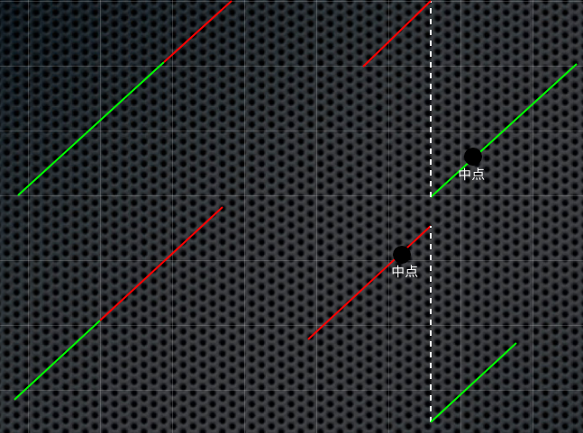

## 1. 思路

由于要求`O(log n)`的时间复杂度，这道题又是查找的题型，猜想肯定需要用二分来解决。但是由于数组在某个节点上被旋转了，因此普通的二分查找肯定不行。我们可以借助下图来理解：


对于反转处的节点位置，有两种情况：
1. 位于数组的前半部分，中点处于绿色线段处
2. 位于数组的后半部分，中点处于红色线段处

然后，我们应该如何查找呢？首先按正常的二分查找一样，设置查找的上下界`lo`和`hi`。 就反转处节点位置来讨论，对于第一种情况，假如要查找的数正好位于中点和`hi`之间(形成一个有序区域)，则把`lo`修改为`mid + 1`；否则，将`hi`修改为`mid - 1`。

对于第二种情况，则类比第一种情况即可推出。

## 2. 实现
```cpp
int search(vector<int>& nums, int target) {
    int lo = 0, hi = nums.size() - 1;
    while (lo <= hi) {
        int mid = lo + (hi - lo) / 2;
        if (nums[mid] == target) return mid;
        if (nums[mid] < nums[hi]) {
            if (nums[mid] < target && target <= nums[hi]) lo = mid + 1;
            else hi = mid - 1;
        } else {
            if (nums[lo] <= target && target < nums[mid]) hi = mid - 1;
            else lo = mid + 1;
        }
    }
    return -1;
}
```