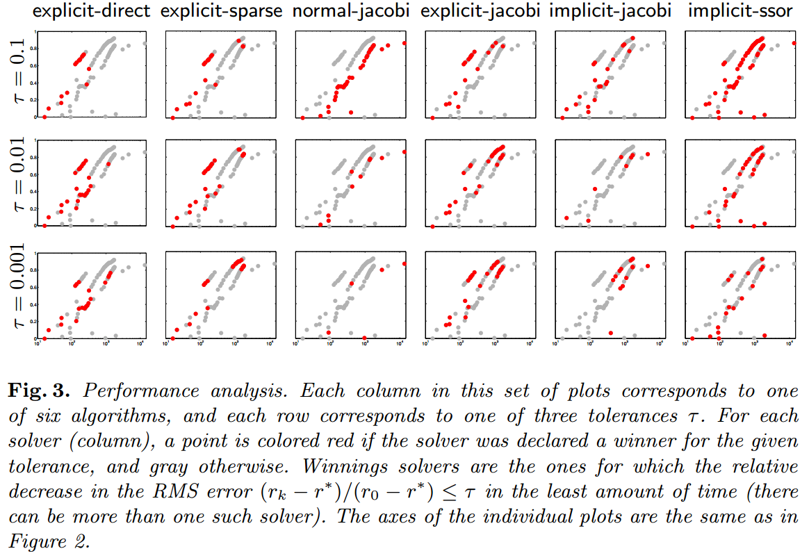
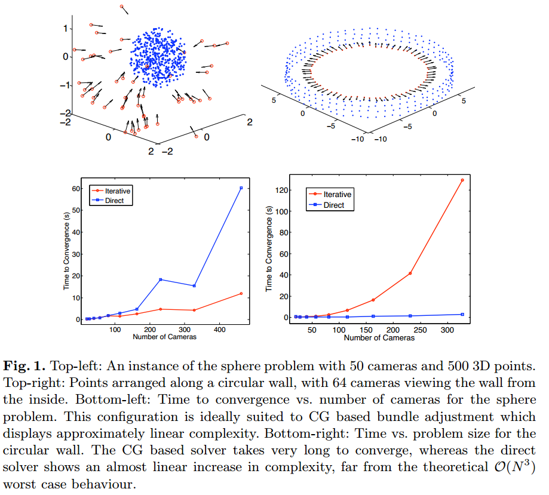
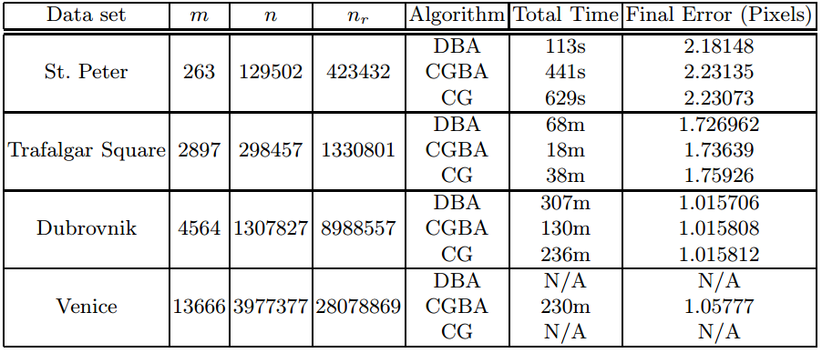

# Bundle Adjustment

## 1. Required Mathematics Background

### 1.1 Linear Algebra
### 1.1.1. Schur Complement

对于线性方程组
$$
\left[
  \begin{array}{cc}
\mathbf{A} & \mathbf{W}\\
\mathbf{W}^T & \mathbf{B}
\end{array}
\right] 
\left[
  \begin{array}{c}
  \mathbf{x}_m \\
  \mathbf{x}_p
  \end{array}
\right] = 
\left[
  \begin{array}{c}
    \mathbf{b}_m \\
    \mathbf{b}_p
  \end{array}
\right]. \tag{2.1}
$$

可以通过矩阵的初等行/列变换来消除 $\mathbf{x}_m$ 或 $ \mathbf{x}_p$.
(1) 若消去$\mathbf{x}_p$,我们可以在等式左右两边同乘 
$$
\left[
  \begin{array}{cc}
    \mathbf{I} & -\mathbf{W} \mathbf{B}^{-1} \\
    \mathbf{0} & \mathbf{I}
  \end{array}
\right]. \tag{2.2}
$$

则有
$$
\left[
  \begin{array}{cc}
    \mathbf{I} & -\mathbf{W} \mathbf{B}^{-1} \\
    \mathbf{0} & \mathbf{I}
  \end{array}
\right]
\left[
  \begin{array}{cc}
\mathbf{A} & \mathbf{W}\\
\mathbf{W}^T & \mathbf{B}
\end{array}
\right] 
\left[
  \begin{array}{c}
  \mathbf{x}_m \\
  \mathbf{x}_p
  \end{array}
\right] = 
\left[
  \begin{array}{cc}
    \mathbf{I} & -\mathbf{W} \mathbf{B}^{-1} \\
    \mathbf{0} & \mathbf{I}
  \end{array}
\right]
\left[
  \begin{array}{c}
    \mathbf{b}_m \\
    \mathbf{b}_p
  \end{array}
\right]. \tag{2.3}
$$

简化可得

$$
\left[
  \begin{array}{cc}
    \mathbf{A}-\mathbf{W}\mathbf{B}^{-1}\mathbf{W} & \mathbf{0} \\
    \mathbf{W}^T & \mathbf{B}
  \end{array}
\right] 
\left[
  \begin{array}{c}
  \mathbf{x}_m \\
  \mathbf{x}_p
  \end{array}
\right] =
\left[
  \begin{array}{c}
    \mathbf{b}_m-\mathbf{W} \mathbf{B}^{-1} \mathbf{b}_p \\
    \mathbf{b}_p
  \end{array}
\right]. \tag{2.4}
$$
其中 $\mathbf{A} - \mathbf{W}\mathbf{B}^{-1}\mathbf{W}$ 称为 $B$ 在矩阵中的Schur Complement.


(2) 若消去 $\mathbf{x}_m$,则可在等式左右两边同乘
$$
\left[
  \begin{array}{cc}
    \mathbf{I} & \mathbf{0} \\
    \mathbf{W}^T \mathbf{A}^{-1} & \mathbf{I}
  \end{array}
\right]
\left[
  \begin{array}{cc}
\mathbf{A} & \mathbf{W}\\
\mathbf{W}^T & \mathbf{B}
  \end{array}
\right] 
\left[
  \begin{array}{c}
  \mathbf{x}_m \\
  \mathbf{x}_p
  \end{array}
\right] =
\left[
  \begin{array}{cc}
    \mathbf{I} & \mathbf{0} \\
    \mathbf{W}^T \mathbf{A}^{-1} & \mathbf{I}
  \end{array}
\right]
\left[
  \begin{array}{c}
  \mathbf{b}_m \\
  \mathbf{b}_p
  \end{array}
\right]. \tag{2.5}
$$

简化可得,
$$
\left[
  \begin{array}{cc}
    \mathbf{A} & \mathbf{W} \\
    \mathbf{0} & \mathbf{W}^T \mathbf{A}^{-1} \mathbf{W} - \mathbf{B}
  \end{array}
\right]
\left[
  \begin{array}{c}
    \mathbf{x}_m \\
    \mathbf{x}_p
  \end{array}
\right] =
\left[
  \begin{array}{c}
  \mathbf{b}_m \\
  \mathbf{W}^T \mathbf{A}^{-1} \mathbf{b}_m - \mathbf{b}_p
  \end{array}
\right]. \tag{2.6}
$$

其中 $\mathbf{W}^T \mathbf{A}^{-1} \mathbf{W} - \mathbf{B}$ 为 $\mathbf{A}$ 在原矩阵中的Schur Complement.

### 1.1.2 Cholesky Decomposition

TODO: 

## 1.2 Numerical Optimization

### 1.2.1 Newton-type Methods (GD\GN\LM)
TODO:

### 1.2.2 Conjugate Gradient
TODO:

## 2. Bundle Adjustment
### 2.1 Background
TODO:

### 2.2 Direct/Exact Solvers

### 2.3 Inexact Solvers

考虑 Normal Equation:

$$
\left[
  \begin{array}{cc}
    \mathbf{B} & \mathbf{E} \\
    \mathbf{E}^T & \mathbf{B}
  \end{array}
\right]
\left[
    \begin{array}{c}
    \Delta \mathbf{y} \\ 
    \Delta \mathbf{z}
    \end{array}
\right] =
\left[
  \begin{array}{c}
    \mathbf{y} \\
    \mathbf{w}  
  \end{array}
\right]
$$

$\mathbf{C}$ 的 Schur Complement 为 $\mathbf{S} = \mathbf{B} - \mathbf{E} \mathbf{C}^{-1} \mathbf{E}^T$,
***Reduced Camera System*** 为 $\mathbf{S} \Delta \mathbf{y} = \mathbf{v} - \mathbf{E} \mathbf{C}^{-1} \mathbf{w}$.
我们有如下几种方法求解 Reduced Camera System:
(1) **直接法**. 由于 $\mathbf{S}$ 为对称正定阵, 因此我们可以采用 Cholesky Decomposition 来求解. 直接法又分为以下两种方法:
- Dense Factorization. 稠密分解的空间复杂度为 $O(p^2)$, 时间复杂度为 $O(p^3)$.
- Sparse Factorization. 稀疏分解法需要对行和列进行重新排列来最大化 Cholesky Decomposition 的稀疏性. 这种方法也依赖 $\mathbf{S}$ 的稀疏结构.

(2) **非直接法**, 或者称为 **Inexact Linear Solver**. LM 算法是迭代算法, 因此有的认为, 在每一步迭代里都去计算一个精确解是没有必要的. 与此相反, 我们可以通过构造一个优化问题来寻求一个近似解. 这也被称作 ***Inexact/Truncated Newton Method***. 对于非精确牛顿法, 有两个需要关注的点: 1) 合适的迭代求解器; 2) 终止准则. 我们在 BA 里一般采用 **共轭梯度法** (Conjugate Gradient). 接下来我们便要考虑如何在 LM 的每一步迭代里进行求解.

对于 Normal Equation $\mathbf{H}_{\mu} \Delta \mathbf{x} = -\mathbf{g}$, 共轭梯度的收敛性取决于 $\mathbf{H}_{\mu}$ 的条件数 $\kappa (\mathbf{H}_{\mu})$. 条件数的一个上确界是 $\kappa (\mathbf{H}_{\mu}) = \sqrt{\kappa (\mathbf{J}^T \mathbf{J})}$. 如果我们直接用共轭梯度法求解 Normal Equation 的话, 由于 $\mathbf{H}_{\mu}$ 的条件数太大会导致性能很差. 那么怎么来解决这个问题呢? 这时候, 带着拯救万千算法工程师的使命与责任, 我们的 ***preconditioner*** 出场了.

### 2.3.1 关于 Preconditioner
对于 linear system $\mathbf{A} \mathbf{x} = \mathbf{b}$, 我们对等式左右两边同乘 preconditioner $\mathbf{M}$ 的逆, 得到preconditioned linear system $\mathbf{M}^{-1} \mathbf{A} \mathbf{x} = \mathbf{M}^{-1} \mathbf{b}$. 使用了 preconditioner 的共轭梯度算法则被称为 ***Preconditioned Conjugate Gradient (PCG)*** . 对于 PCG, 条件数变为了 $\kappa (\mathbf{M}^{-1} \mathbf{A})$. 前面讲到, linear system 的求解性能和条件数高度相关. 因此, 现在的问题变成了: 如何构造 preconditioner, 来使得条件数越小越好? 下面我们来分情况讨论.

- 一个最理想的 preconditioner 是 $\mathbf{M} = \mathbf{A}$, 这样的话条件数变为了 $\kappa (\mathbf{M}^{-1} \mathbf{A}) = \kappa (\mathbf{I}) = 1$.
但是, 选择 $\mathbf{A}$ 为条件数会导致求逆运算, 进而导致时间复杂度非常高.

- 一个最简单的 preconditioner 是 diagonal 或 Jacobi preconditioner, 如 $\mathbf{M} = diag(\mathbf{A}) = diag(\mathbf{H}_{\mu})$, 该 
preconditioner 称为 ***Block Diagonal Jacobi Preconditioner*** ($\mathbf{M}_{J}$). 由于 $\mathbf{H}_{\mu}$ 的对角块 $\mathbf{B}, \mathbf{C}$ 都是
块对角矩阵, 因而 

$$
\mathbf{M}_{J} = 
\left[
  \begin{array}{cc}
    \mathbf{B} & \mathbf{0} \\
    \mathbf{0} & \mathbf{C}
  \end{array}
\right].
$$

- 另一种方法则是将 PCG 用于 Reduced Camera Matrix $\mathbf{S}$, 而不是 $\mathbf{H}_{\mu}$ 上. 这么做有几个
原因: (1) $\mathbf{S}$ 比 $\mathbf{H}_{\mu}$ 小得多; (2) $\kappa (\mathbf{S}) \leq \kappa (\mathbf{H}_{\mu})$. 我们很容易想到 $\mathbf{S}$ 的两种 preconditioner: $\mathbf{B}$ 及 $S$ 的对角块 $\mathcal{D} (\mathbf{S})$. 

对于分别应用 PCG 到 Hessian $\mathbf{H}_{\mu}$ 和 reduced camera matrix $\mathbf{S}$, 这两者之间有什么联系吗?
[4] 通过 ***Generalized Symmetric Successive Over-Relaxation (SSOR)*** 对这两者进行了解释. 
令 

$$
\mathbf{M}_{\omega} (\mathbf{P}) =
\mathbf{M}_{J} = 
\left[
  \begin{array}{cc}
    \mathbf{P} & \omega \mathbf{E} \\
    \mathbf{0} & \mathbf{C}
  \end{array}
\right]
\left[
  \begin{array}{cc}
    \mathbf{P}^{-1} & \mathbf{0} \\
    \mathbf{0} & \mathbf{C}^{-1}
  \end{array}
\right]
\left[
  \begin{array}{cc}
    \mathbf{P} & \mathbf{0} \\
    \omega \mathbf{E}^{T} & \mathbf{C}
  \end{array}
\right],
$$

其中 $\mathbf{P}$ 可以是某些非常容易进行逆运算的矩阵, $\omega \in [0, 2)$ 则是一个标量参数. 对于 $\mathbf{M}_{\omega} (\mathbf{P})$ 有:
- $\mathbf{M}_{0} (\mathbf{B}) = \left[
  \begin{array}{cc}
    \mathbf{B} & \mathbf{0} \\
    \mathbf{0} & \mathbf{C}
  \end{array}
\right] = \mathbf{M}_J$, 也就是 Block Jacobian Preconditioner.

- $\mathbf{M}_{1} (\mathbf{P}) = \left[
  \begin{array}{cc}
    \mathbf{P} + \mathbf{E} \mathbf{C}^{-1} \mathbf{E}^T & \mathbf{E} \\
    \mathbf{E}^T & \mathbf{C}
  \end{array}
\right] = \mathbf{M}_J$. 注意左上角的块矩阵等于 $\mathbf{S} (\mathbf{P})$, 因此当 $\omega = 1$ 时,
将 $\mathbf{P}$ 用于 $\mathbf{H}_{\mu}$ 等价于将 $\mathbf{P}$ 应用于 $\mathbf{S}$. 进而可以得到, 将 $\mathbf{M}(\mathbf{I})$ 应用于 $\mathbf{H}_{\mu}$ 等价于在 $\mathbf{S}$ 上用无 preconditioner　的 conjugate gradient.

- 由于 $\mathbf{M}_{1} (\mathbf{B}) = \left[
  \begin{array}{cc}
    \mathbf{B} + \mathbf{E} \mathbf{C}^{-1} \mathbf{E}^T & \mathbf{E} \\
    \mathbf{E}^T & \mathbf{C}
  \end{array}
\right]$, 因此将 $\mathbf{B}$ 应用于 $\mathbf{S}$ 等价于将　$\mathbf{M}_{1} (\mathbf{B})$ 应用于 $\mathbf{H}_{\mu}$. 同理， 将　$\mathcal{D} (\mathbf{S})$ 应用于 $\mathbf{S}$ 等价于将　$\mathbf{M}_{1} (\mathcal{D} (\mathbf{S}))$ 应用于 $\mathbf{H}_{\mu}$.

对于这几种 preconditioner , [4] 构造了一些数据集 (Ladybug, Skeletal, Final) 来进行评测. 这些数据集的 $S$ 矩阵的稀疏性可以见下图 (其中白色的为小规模的稠密数据集, 以及灰色深度的不同分别为: 小规模的稀疏数据集, 大规模的稠密数据集, 大规模的稀疏数据集):
<div align="center">
  
</div>

在这些数据集上进行评测的结果如下图:
<div align="center">
  
</div>

其中 *explicit-direct, explicit-sparse, explicit-jacobi* 表示显示构造 $\mathbf{S}$ 并且分别使用 *稠密分解, 稀疏直接分解, 使用 block Jacobi preconditioner 的 PCG* 方法, *normal-jacobi* 表示在 $\mathbf{H}_{\mu}$ 上使用 *block Jacobi preconditioner $\mathbf{M}_{J}$* 的 PCG, *implicit-jacobi, implicit-ssor* 分别表示对 $\mathbf{S}$ 使用 block Jacobi preconditioner $\mathcal{D}(\mathbf{S}), \mathbf{B}$ 的 PCG 方法. 红色的点表示用最少时间达到收敛条件的方法. 该评测结果的一个结论是:
- 对于大规模问题, 非精确求解方法相比基于 Cholesky factorization 的方法在时间和内存上都有非常大的优势. 并且对于中等规模的数据 (包含几千张图片), 非精确求解方法仍然比 Cholesky factorization 的方法块一个数量级并且少 3-5 倍的内存.
- 对于介于小到中等规模之间数据集, 推荐使用 dense cholesky factorization. 对于更大规模的问题, 哪种 preconditioner 更好没有一个统一的结论, 需要根据具体问题具体分析. 但是 *implicit-ssor* 更适用于不那么稀疏的问题, 而 *explicit-jacobi* 更适用于稀疏程度较高的问题. 


### 2.3.2 其他类型的 Preconditioner

#### (1) QR Preconditioner
同样是将 preconditioner 运用于 $\mathbf{H}_{\mu}$，[6] 通过 QR 分解， 得到了一种比 Block Jacobian Preconditioner $\mathbf{M}_{J}$ 更优的 preconditioner. [6] 中对 preconditioned linear system 构造了一种不同的形式. 对于 linear system $\mathbf{A} \mathbf{x} = \mathbf{b}$, 令 $\mathbf{x} = \mathbf{E} \hat{\mathbf{x}}$, 因此 preconditioned linear system 变为

$$
\mathbf{E}^T \mathbf{A} \mathbf{E} \hat{\mathbf{x}} = \mathbf{E}^T \mathbf{b}.
$$

同样，我们也需要选择合适的 $\mathbf{E}$，使得 $\mathbf{E}^T \mathbf{A} \mathbf{E} \hat{\mathbf{x}}$ 有更小的条件数. 考虑 Jacobi $\mathbf{J}$ 的QR分解 $\mathbf{J} = \mathbf{Q} \mathbf{R}$, 并且令 $\mathbf{E} = \mathbf{R}^{-1}$, 那么 preconditioned normal equation 可以写为:

$$
\mathbf{R}^{-T} \mathbf{J}^T \mathbf{J} \mathbf{R}^{-1} \Delta \hat{\mathbf{x}} = -\mathbf{E}^{-T} \mathbf{J}^T \mathbf{r},
$$

我们把 $\mathbf{J} = \mathbf{Q} \mathbf{R}$ 代入上式， 可以得到 $\Delta \hat{\mathbf{x}} = -\mathbf{E}^{-T} \mathbf{J}^T \mathbf{r}$. 因此 $\Delta \hat{\mathbf{x}}$ 只要一步迭代就能得到， 并且 $\Delta \mathbf{x} = - \mathbf{R}^{-T} \Delta \hat{\mathbf{x}}$ 得到. 现在还需要考虑的就是: 如何避免 $\mathbf{J} = \mathbf{Q} \mathbf{R}$ 这样代价昂贵的操作呢 ? 

注意到我们对变量进行划分 $\mathbf{x} = [\mathbf{x}_{C},\ \mathbf{x}_{P}]^T$， 因此 Jacobi 也可以做划分 $\mathbf{J} = [\mathbf{J}_{C},\ \mathbf{J}_{P}]$. 分别对 $\mathbf{J}_{C},\ \mathbf{J}_{P}$ 进行QR分解，有
$$
\mathbf{J}_{C} = \mathbf{Q}_{C}\mathbf{R}_{C},\ \mathbf{J}_{R} = \mathbf{Q}_{R}\mathbf{R}_{R}.
$$
令
$$
\mathbf{A}_k =
\left[
  \begin{array}{c}
    \frac{\partial r_{k1}}{\partial {\mathbf{x}_{C}}_1} \\
    \frac{\partial r_{k2}}{\partial {\mathbf{x}_{C}}_2} \\
    \vdots \\
    \frac{\partial r_{kn}}{\partial {\mathbf{x}_{C}}_n}
  \end{array}
\right],
\mathbf{B}_k =
\left[
  \begin{array}{c}
    \frac{\partial r_{1k}}{\partial {\mathbf{x}_{P}}_1} \\
    \frac{\partial r_{2k}}{\partial {\mathbf{x}_{P}}_2} \\
    \vdots \\
    \frac{\partial r_{mk}}{\partial {\mathbf{x}_{C}}_m}
  \end{array}
\right]
$$
由于 $\mathbf{J}_{C}, \mathbf{J}_{R}$ 的特殊的块结构
$$
\mathbf{J}_{C} = [\mathbf{A}_{1}, \mathbf{A}_{2},\ \cdots, \mathbf{A}_{m}], \mathbf{J}_{P} = [\mathbf{B}_{1}, \mathbf{B}_{2},\ \cdots, \mathbf{B}_{n}],
$$

我们有

$$
\mathbf{R}_{C} = \mathbf{R} (\mathbf{J}_{C}) =
\left[
  \begin{array}{cccc}
    \mathbf{R}(\mathbf{A}_{1}) & & & \\
     & \mathbf{R}(\mathbf{A}_{2}) & & \\
    & & \ddots & \\
     & & & \mathbf{R}(\mathbf{A}_{m})
  \end{array}
\right],
\mathbf{R}_{P} = \mathbf{R} (\mathbf{J}_{P}) =
\left[
  \begin{array}{cccc}
    \mathbf{R}(\mathbf{B}_{1}) & & & \\
     & \mathbf{R}(\mathbf{B}_{2}) & & \\
    & & \ddots & \\
     & & & \mathbf{R}(\mathbf{B}_{n})
  \end{array}
\right]
$$

这也意味着我们能够在 **$\mathbf{J}_{C}$ 和 $\mathbf{J}_{P}$ 的每列(blockwise)上独立地进行QR分解!!!**. 这样时间复杂度大大地降低了！到这里，很容易想到的一个 preconditioner 是
$$
\mathbf{E} =
\left[
  \begin{array}{cc}
    \mathbf{R}(\mathbf{J}_{C})^{-1} &  \\
     & \mathbf{R}(\mathbf{J}_{P})^{-1}
  \end{array}
\right]
$$
尽管基于 QR 分解的 preconditioner (以下我们称作 QR Preconditioner) 和 Block Jacobi Preconditioner 是 analytically equivalent, 但是 QR Preconditioner 有两个优点: (1) 不必显示地构造 $\mathbf{J}^T \mathbf{J}$; (2) $\mathbf{A}$ 的 QR 分解比 $\mathbf{A}^T \mathbf{A}$ 的 Cholesky 分解数值上更优.

使用 QR Preconditioner 的 preconditioned system matrix $\hat{\mathbf{J}}^T \hat{\mathbf{J}}$ 具有 *Property A* (这个 Property A 不具体展开讲). 而具有 Property A 的矩阵在使用共轭梯度的时候的一个好处是 ***能够使共轭梯度的执行代价减半*** ! 而另一个好处就是 ***Block Jacobi Preconditioner 总是要比 Gauss-Seidel 和 SSOR Preconditioner 更好***! (详见 [6])

[6] 对 QR Preconditioner 在仿真数据集和 internet 数据集上均进行了实验.
<div align="center">
  
</div>

其中仿真数据集上的实验表明，共轭梯度(也就是图中的 Iterative 方法)在较稠密的数据上比直接表现更好，而在稀疏的数据集上收敛很慢。作者给出的一个解释是: 共轭梯度作为一种加速的一阶方法，信息需要在变量直接流动，而稠密的数据上信息流动更快。
`
<div align="center">
  
</div>

而在 internet 数据集上的实验可以直接看到 QR Preconditioner 的优势了。而这四个数据的 Schur Complement 的稀疏结构也可以从下图看出.

<div align="center">
  
</div>


#### (2) Generalized Subgraph Preconditioner
TODO:

#### (3) Visibility Cluster Preconditioner
[9] 中提出基于共视关系对 camera 进行 clustering 来构造 reduced linear matrix $\mathbf{S}$ 的 preconditioner. 注意到 $\mathbf{S} = \mathbf{U} - \mathbf{W}\mathbf{V}^{-1} \mathbf{W}^T$, 因此 S 主要由和相机相关的信息 ($\mathbf{U}$) 以及相机共视信息 ($\mathbf{W}\mathbf{W}^T$) 构成. 首先是如何对 camera 进行聚类, 才能让联系较强的 camera 的信息尽量聚集在一起.

首先是定义相机之间的 visibility vector: $\mathbf{v}_i \in \{0,\ 1\}^{n_p}$, 然后每两个相机之间的相似度可以定义为对应的归一化 visibility vector 之间的点积. [9] 中使用 `Canonical Views` 算法来进行 camera clustering. Canonical Views 算法最大化如下代价函数来计算集合 $C$:
$$
\sum_{i \in I} \max_{j \in C} \frac{v_i^T v_j}{\|v_i \| \|v_j\|} - \alpha |C|,
$$

其中前面的那项用于最大化覆盖度, 后面的那项用于最小化所选的 canonical views 的数量.

在得到聚类结果之后, $\mathbf{S}$ 的行和列可以进行重排, 使得 cluster 1 的 camera 在 cluster 2 的 camera 前面, 以此类推. 下图的 $\mathbf{S_1}$ 为对 $\mathbf{S}$ 重排后得到的矩阵. 可以看到, 和 $\mathbf{S}$ 相比, $\mathbf{S_1}$ 的很多的元素都更靠近对角线附近. 而 $\mathbf{S_1}$ 的对角块上的元素, 则被选为 preconditioner, 我们称为 **cluster-jacobi** . 可以看出, Block Jacobi Preconditioner $\mathbf{M}_J$ 是 **cluster-jacobi** 的一种特殊情况, 其中 $\mathbf{M}_J$ 的 cluster 大小均为1.

<div align="center">
  
</div>

尽管 cluster-jacobi 是比 $\mathbf{M}_J$ 更好的 preconditioner, 但是我们还能做的更好. 注意到 cluster-jacobi 每个 cluster 只包含该 cluster 内部相机之间信息, 而 $\mathbf{S_1}$ 的非对角块的元素也有比较重要的作用. 我们想要把这些元素也加进来, 但是又不能全都加进来. [9] 中考虑的一种策略是使用那种不会使得 Cholesky 分解造成额外 fill-in 的元素 (称作 `block band diagonal matrices`). 考虑其中最简单的一种, 也就是 block-tridiagonal (三对角块矩阵) $\mathbf{S_2}$, 即对角线处有三个块矩阵. 很容易想到, 这和矩阵的 bandwidth reduction 是很像的. [9] 中提出了一种贪心算法来构造这样一个矩阵.

很容易知道, 如果 $\mathbf{S_2}$ 需要成为一个 block-tridiagonal 矩阵, 那么该块矩阵所对应的图一定是一个度为2的图(也就是, 图中任意一个节点的度都不超过2). 进一步, 我们可以构造一个度为2的树结构来近似 $\mathbf{S_2}$. 但是, 这样一个近似并不是总能够构成图的一个生成树, 比如 星状图. 我们可以通过找到图的互相独立的度为2的树的集合, 然后将这些集合拼接在一起来得到一个排序. 这些集合可以通过对 Kruskal 算法进行一些改造来得到. 这样得到的矩阵称为 **cluster-tridiagonal preconditioner**. 需要注意的是, 当前的 cluster-tridiagonal 的正定性并不总是能够得到保证的. 幸运的是, 该矩阵的正定性可以通过对非对角块元素的缩放来维持. 具体见 [9] 中的 Lemma 1.

同 [4] 一样, [9] 对一系列的 preconditioner 进行了 performance profile.
<div align="center">
  
</div>

可以看到 cluster-jacobi 和 cluster-tridiagonal preconditioner 优势相当明显, 然后是 implicit-ssor(也就是隐式构造 $\mathbf{S}$ 并使用 $\mathbf{S}$ 的对角块元素作为 preconditioner).
<div align="center">
  
</div>

然后时在大规模问题上求解 Schur Complement 的性能. 可以看到 cluster-jacobi 和 cluster-tridiagonal 依然稳稳占据前2. cluster-tridiagonal 在 Vienice 上的优势更为明显. 但是, 由于 cluster-jacobi 和 cluster-tridiagonal 都需要额外的操作来对矩阵进行 reordering, 所以最后还要看看总的时间.

<div align="center">
  
</div>

这个时候可以看到, cluster-jacobi 和 cluster-tridiagonal 的优势已经没那么明显了. 不过当收敛条件缩紧的时候 ($\tau$ 减少, 也即迭代次数变多), 这两种基于共视关系聚类得到的 preconditioner 依然有很大的优势. 另外一个注意到的地方就是 cluster-jacobi 和 cluster-tridiagonal 的性能已经差不多了, cluster-jacobi 甚至在某些情况下要更好. 作者给出的一个原因是, 对于较大的 forcing sequence $\tau$, 基本不太需要较过复杂的 preconditioner 来达到收敛条件. 换句话说, 就是如果收敛条件越松, 那么稍微不那么好的 preconditioner 也能很快收敛; 而且由于不需要复杂的构造 preconditioner 的过程, 性能反而会更好.

### 2.3.3 Preconditioner 小结

ceres-solver 实现了大多数我们提到的 preconditioner, 包括 Block Diagonal Jacobi , Implicit SSOR, cluster-Jacobi, cluster-tridiagonal, 分别对应下面代码中的 JACOBI, SCHUR_JACOBI, CLUSTER_JACOBI, CLUSTER_TRIDIAGONAL.

```C++
// Included in <ceres/types.h>
enum PreconditionerType {
  // Trivial preconditioner - the identity matrix.
  IDENTITY,

  // Block diagonal of the Gauss-Newton Hessian.
  JACOBI,

  // Note: The following three preconditioners can only be used with
  // the ITERATIVE_SCHUR solver. They are well suited for Structure
  // from Motion problems.

  // Block diagonal of the Schur complement. This preconditioner may
  // only be used with the ITERATIVE_SCHUR solver.
  SCHUR_JACOBI,

  // Visibility clustering based preconditioners.
  //
  // The following two preconditioners use the visibility structure of
  // the scene to determine the sparsity structure of the
  // preconditioner. This is done using a clustering algorithm. The
  // available visibility clustering algorithms are described below.
  CLUSTER_JACOBI,
  CLUSTER_TRIDIAGONAL,

  // Subset preconditioner is a general purpose preconditioner
  // linear least squares problems. Given a set of residual blocks,
  // it uses the corresponding subset of the rows of the Jacobian to
  // construct a preconditioner.
  //
  // Suppose the Jacobian J has been horizontally partitioned as
  //
  // J = [P]
  //     [Q]
  //
  // Where, Q is the set of rows corresponding to the residual
  // blocks in residual_blocks_for_subset_preconditioner.
  //
  // The preconditioner is the inverse of the matrix Q'Q.
  //
  // Obviously, the efficacy of the preconditioner depends on how
  // well the matrix Q approximates J'J, or how well the chosen
  // residual blocks approximate the non-linear least squares
  // problem.
  SUBSET,
};
```

由于 Canonical Views 算法比较慢, ceres-solver 还提供了 single-linkage 算法来更快地对 camera 进行聚类.
```C++
enum VisibilityClusteringType {
  // Canonical views algorithm as described in
  //
  // "Scene Summarization for Online Image Collections", Ian Simon, Noah
  // Snavely, Steven M. Seitz, ICCV 2007.
  //
  // This clustering algorithm can be quite slow, but gives high
  // quality clusters. The original visibility based clustering paper
  // used this algorithm.
  CANONICAL_VIEWS,

  // The classic single linkage algorithm. It is extremely fast as
  // compared to CANONICAL_VIEWS, but can give slightly poorer
  // results. For problems with large number of cameras though, this
  // is generally a pretty good option.
  //
  // If you are using SCHUR_JACOBI preconditioner and have SuiteSparse
  // available, CLUSTER_JACOBI and CLUSTER_TRIDIAGONAL in combination
  // with the SINGLE_LINKAGE algorithm will generally give better
  // results.
  SINGLE_LINKAGE
};
```

### 2.4 Distributed Solvers