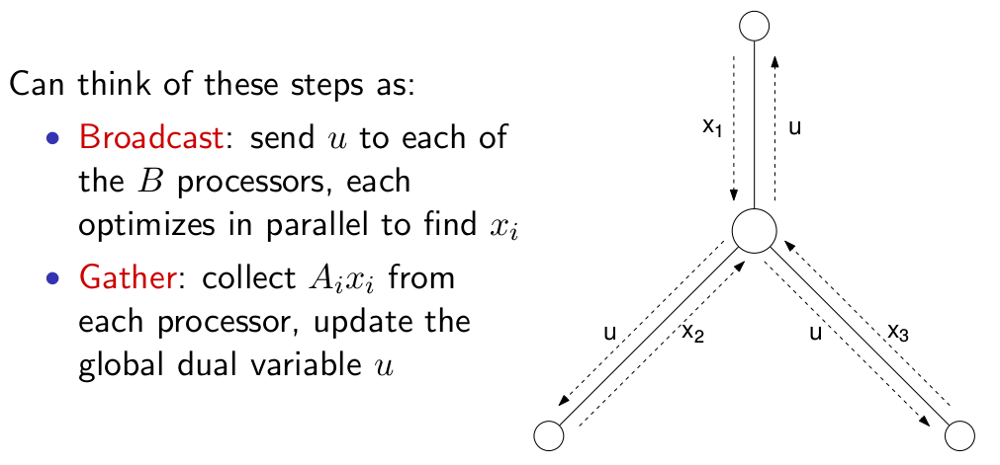

# 交替方向乘子法 (Alternating Direction Method of Multipliers, ADMM)

ADMM 是一种可用于求解大规模优化问题的方法。它可以看作融合了约束优化问题中 dual decomposition 和 augmented Lagrangian 方法的优点。

## 1. Precursor

### 1.1 Dual Problem
考虑如下约束优化问题：

$$
minimize\ f(x) \quad\\
subject to\ Ax = b \tag{1.1}
$$
其中 $x \in R^{n}, A \in R^{m\times n}, f: R^n \rightarrow R$ 是凸函数。

(1.1) 的拉格朗日函数是 

$$
L(x, y) = f(x) + y^T(Ax - b) \tag{1.2}
$$

，其中 $y$ 是拉格朗日乘子 (Lagrange multiplier)，并且其对偶函数为 

$$
g(y) = \inf_x L(x,y) = -f^{*}(-A^Ty) - b^Ty \tag{1.3}
$$

，其中 $y$ 称为对偶变量 (dual variable) 或拉格朗日乘子，$f^{*}$ 是 $f$ 的共轭函数。因此 (1.1) 的`对偶问题 (dual problem)` 为( (1.1) 也称为 `primal problem`)

$$
maximize\ g(y) \tag{1.4}
$$

在强对偶(strong duality) 成立的情况下， primal problem 和 dual problem 的最优值是相同的。那么，为什么对偶问题是最大化对偶函数的求解呢？由于对偶函数提供了最优值的一个下确界，那么为了最小化 duality gap(primal problem和 dual problem的最优值之间的差)，那么我们肯定需要最大化这个下确界。

### 1.2 Dual Ascent

我们可以从对偶问题的最优点 $y^{*}$ 得到主问题的最优点 $x^{*}$:

$$
x^{*} = \argmin_x L(x, y^{*})
$$
，如果 $L(x, y^{*})$ 只存在一个最优点。

对于 `对偶上升(dual ascent)` 方法，对偶问题的通过`梯度上升(gradient ascent)`求解。假设 $g$ 是可微的，那么$\nabla g(y)$ 可以通过如下方法求解：(1) 求解 $x^{+} = \argmin_x L(x, y)$; (2) $\nabla g(y) = Ax^{+} - b$，也就是等式约束的残差 (residual)。因此，我们很容易得到 dual ascent 方法包含两个迭代步骤:

$$
x^{k+1} = \argmin_x L(x, y^k) \tag{1.5}
$$

$$
y^{k+1} = y^k + \alpha^k (Ax^{k+1} - b) \tag{1.6}
$$

其中 $\alpha^k > 0$ 是步长，$k$ 表示迭代次数。(1.5) 是 $x-minimization$ 的一个步骤，(1.6) 是对偶变量的更新步骤。这个算法称为 `dual ascent`是因为通过适当的选择 $\alpha$，对偶函数在每一步都递增，也即 $g(y^{k+1} > g(y^k))$。Dual ascent 也能用在当 $g$ 不可微的情况下，不过这个时候需要把梯度变为次梯度 (subgradient)。

## 1.3 Dual Decomposition

Dual ascent 的主要好处是在某些场景下，利用它能推导出一个去中心化 (decentralized) 的算法: 我们假设目标函数 $f$ 是可分的 (separable)，即

$$
f(x) = \sum_{i=1}^N f_i(x_i)
$$

其中，$x = (x_1, \cdots, x_N)$ 并且变量 $x_i \in R^{n_i}$ 是 $x$ 的子向量。将矩阵 $A$ 划分为

$$
A = [A_1 \cdots A_N],
$$
那么 $Ax = \sum_{i=1}^N A_i x_i$，拉格朗日函数可写为

$$
L(x, y) = \sum_{i=1}^N L_i(x_i, y) = \sum_{i=1}^N (f_i(x_i) + y^TA_i x_i - \frac{1}{N}y^Tb,
$$

拉格朗日函数在 $x$ 上也是可分的。这意味着分为独立的 $N$ 个问题的 x-minimization 步骤可以并行地进行求解，

$$
x_i^{k+1} = \argmin_{x_i} L_i(x_i, y^k) \tag{1.7}
$$

$$
y^{k+1} = y^k + \alpha^k (Ax^{k+1} - b) \tag{1.8}
$$

对于每个 $i = 1,\cdots, N$，(1.7) 可以独立地并行执行。这种情况下，dual ascent 又称为 `dual decomposition`。

通常，dual decomposition 的每一步迭代都包含一个 `broadcast` 和一个 `gather` 的操作。在 (1.8)中，$A_ix_i^{k+1}$ 被收集 (gathered) 在一起来计算残差 $Ax^{k+1} - b$。当全局对偶变量 $y^{k+1}$ 计算完成之后，它就被广播 (broadcast) 到每个处理器执行 $N$ 个独立的 $x_i$ minimization 步骤。如下图所示:



## 2. Augmented Lagrangian Multipliers

增广拉格朗日 (Augmented Lagrangian) 最初是为了使 dual ascent 方法变得更为鲁棒，并且在目标函数 $f$ 没有 strict convexity 或者 finiteness 的情况下产生收敛。(1.1) 的 augmented Lagrangian 为:

$$
L_{\rho}(x, y) = f(x) + y^T (Ax - b) + \frac{\rho}{2}||Ax - b||_2^2 \tag{2.1}
$$

其中 $\rho > 0$ 称做 `penalty parameter`。augmented Lagrangian 可以被看做是以下问题的标准(或 unaugmented) Lagrangian:

$$
minimize\quad f(x) + \frac{\rho}{2}||Ax - b||_2^2\\
subject\ to\quad Ax = b \qquad\qquad\quad \tag{2.2}
$$

其 dual function 为 $g_{\rho}(y) = \inf_x L_{\rho}(x, y)$。使用惩罚项的好处是: 
```
dual function can be shown to be differentiable under rather mild conditions on the original problem.
```
对 (2.2) 应用 dual ascent 可以得到以下算法:

$$
x^{k+1} = \argmin_x L_{\rho}(x, y^k) \tag{2.3}
$$

$$
y^{k+1} = y^k + \rho (Ax^{k+1} - b), \tag{2.4}
$$

(2.3) 和 (2.4) 也被称为求解 (1.1) 的 `乘子法 (method of multipliers)`。除了 x-minimization 使用的是 augmented Lagrangian，以及步长 $alpha^k$ 使用了 penalty parameter $\rho$ 之外，其余的都和标准的 dual ascent 一样。那么为什么在 dual update 的时候，步长选择变成了 $\alpha_k = \rho$ 呢？为了描述方便，我们假设 $f$ 是可微的。问题 (1.1) 的最优性条件是主对偶可行的，即

$$
Ax^{*} - b = 0, \nabla f(x^{*}) + A^Ty^{*} = 0
$$

由定义，$x^{k+1}$ 最小化 $L_{\rho}(x, y^k)$，因此，我们有

$$
0 = \nabla_x L_{\rho}(x^{k+1}, y^k) \qquad\qquad\qquad\qquad\qquad\\
= \nabla_xf(x^{k+1}) + A^T(y^k + \rho(Ax^{k+1} - b))\\
= \nabla_xf(x^{k+1}) + A^Ty^{k+1} \qquad\qquad\qquad\quad
$$

我们可以看到，当在 dual update 的时候，将 $\rho$ 当成步长，迭代 $(x^{k+1}, y^{k+1})$ 是对偶可行的 (dual feasible)。当 $k \rightarrow 0$ 时，$Ax^{k+1} - b \rightarrow 0$，最优性成立。

augmented Lagrangian 方法的优点是有更好的收敛性。但是，当 $f$ 可分的时候，augmented Lagrangian $L_{\rho}$ 不可分，因此 x-minimization 不能并行执行。

## 3. ADMM

前面提到 dual ascent 的优点和 augmented Lagrangian 的优点分别是`可分性(decomposability)`和非常好的收敛性(superior convergence)。ADMM 就是融合了这两种算法的优点而成的。ADMM 通常可以用来求解如下形式的问题:

$$
minimize\ f(x) + g(z)\\
subject\ to\ Ax + Bz = c \tag{3.1}
$$

其中，$x \in R^{n}, z\in R^{m}, A \in R^{p \times n}, B \in R^{p \times m}, c\in R^{p}$。这里假设 $f$ 和 $g$ 都是凸函数。(3.1) 的 augmented Lagrangian 为

$$
L_{\rho}(x, y, z) = f(x) + g(z) + y^T (Ax + Bz - c) + \frac{\rho}{2}||Ax + Bz - c||_2^2
$$

ADMM 则由以下的迭代步骤组成:

$$
x^{k+1} = \argmin_x L_{\rho}(x, z^k, y^k) \tag{3.2}
$$

$$
z^{k+1} = \argmin_x L_{\rho}(x^{k+1}, z, y^k) \tag{3.3}
$$

$$
y^{k+1} = y^k + \rho(Ax^{k+1} + Bz^{k+1} - c) \tag{3.4}
$$

其中 $\rho > 0$。这个算法和 dual ascent 以及 augmented Lagrangian 非常像：它包含一个 `x-minimization` 步骤(3.2)，一个 `z-minimization` 步骤(3.3)，以及 `dual variable update` 步骤(3.4)。和乘子法一样，dual variable 更新时的步长和 augmented Lagrangian 的惩罚参数 $\rho$ 相等。这个版本的迭代算法通常又被称为 `unscaled form of ADMM`。

在 ADMM 中，$x$ 和 $z$ 交替(alternating) 更新 或者序列式(sequential)更新，这也是 `alternating direction` 的由来

### 3.1 Scaled form of ADMM

ADMM 可以被重写为一种更便捷的形式。定义残差 $r=Ax + Bz - c$，则有

$$
y^T(Ax + Bz - c) + \frac{\rho}{2} ||Ax + Bz - c||_2^2 \\
= y^Tr + \frac{\rho}{2} ||r||_2^2\\
= \frac{\rho}{2} ||r + \frac{\rho}{2}y||_2^2 - \frac{1}{2\rho} ||y||_2^2\\
= \frac{\rho}{2} ||r + \mu||_2^2 - \frac{\rho1}{2}||\mu||_2^2
$$

## 4. Consensus and Sharing


## 5. Applications