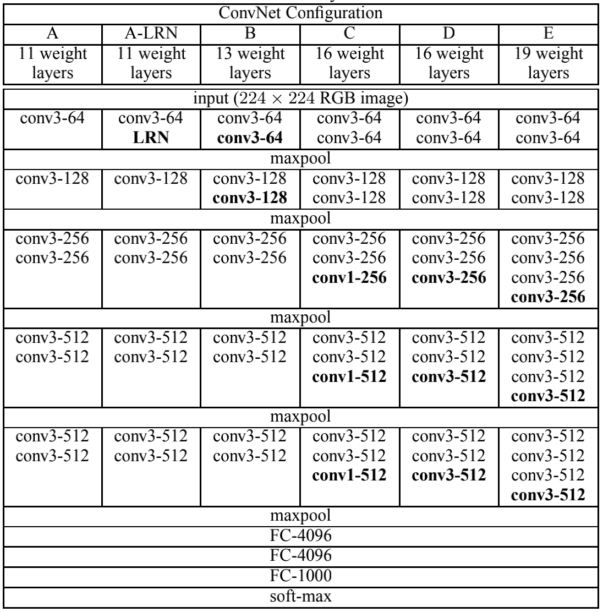

# VERY DEEP CONVOLUTIONAL NETWORKS FOR LARGE-SCALE IMAGE RECOGNITION

总体而言，VGG是一篇非常工程化和实验性的论文，满满的都是工程细节和实验结果。这篇论文通过实验分析了CNN网络层数的增加对网络分类精度的提升。

## 1. Network Architecture

VGG 的网络结构如下. 按网络深度, A, B, D, E 分别称作 VGG-11, VGG-13, VGG-16, VGG-19. 图中的 conv后面跟着的是卷积核大小以及通道数量.

VGG 可以看作是一些基于块(具体来说是 5 个块)的网络的堆叠(stack), 其中每个块都包含 1 个或者多个卷积层, 每个块最后都包含一个 max-pooling 层. 最后是三个全联接层加上一个 softmax.

一些相关参数如下:
- **输入:** 固定大小的 224*224 的 RGB图像.

- **kernel size:** 3*3. 相对于同期的工作来说(比如 GoogleNet), VGG的一大特色就是 *小卷积核* 的使用. 这篇论文也测试了更小的卷积核(1*1), 最后实验说明 ***while the additional non-linearity does help(多了三个kernel-1卷积层的VGG-16 > VGG-13), it is also important to capture spatial context by using conv. filters with non-trivial receptive fields(三个kernel-3的VGG-16 > 三个kernel-1的VGG-16).***

- **stride:** 1 pixel.

- **padding:** 1 pixel (对于3*3的卷积核).

- **pooling:** max-pooling with 2*2 window size and stride 2. 每一个网络块(除了全联接层)最后都跟着一个 max-pooling 层.

### 1.1 为什么这么设计?

#### (1) 为什么在每个块中进行卷积层的堆叠?
两个 3*3 的卷积层的感受野大小是 5*5, 三个 3*3 的卷积层的感受野大小是 7*7, 那么为什么不直接使用一个卷积核大小为 5*5 的卷积层或者 7*7 大小的卷积层呢? 假设每一个卷积层的通道大小为C, 对于一个三层的3*3卷积核大小的卷积块, 参数量为 $3*(3^2*C^2)=27C^2$, 而一个 7*7 大小的卷积层的参数量为 $7*7*C^2=49C^2$. 于是我们可以看到 **在感受野大小相同的情况下, 相对于一个卷积层, 多个卷积层的堆叠可以显著减少网络的参数**.

#### (2) 网络深度提升的作用?

这一步实际上是借鉴了之前的工作(GoodFellow, 2014), 并且说明了更深的网络有助于性能提升.

## 2. Training

### 2.1 Training details

- **optimizer:** mini-batch SGD with momentum, 其中 **batch size** 为 256, **momentum** 为 0.9.

- **Regularization:** $l_2$ weight decay($\lambda=5*10^{-4}$) + Dropout with ratio=0.5(only for the first two fully-connected layers).

- **learning rate:** 初始值为 $10^{-2}$, 并且当在验证集上精度不再提升时将learning rate 除以 10(总共减小了三次).

### 2.2 Weight initialization

- 首先对 VGG-11 随机初始化然后进行训练. 更深层的 VGG 网络用 VGG-11 里对应层的参数初始化，其他中间层随机初始化. 

- weight 用服从$(0, 10^{-2})$ 的高斯分布进行随机初始化, bias全部初始化为 0.

### 2.3 Data augmentation

为了得到固定大小为 $224\times224$ 的图像, *they were randomly cropped from rescaled training images (one crop per image per SGD iteration)*. 为了进一步对训练集进行增强, VGG 采取了和 AlexNet 相同的策略: *the crops underwent random horizontal flipping and rando RGB colour shift*.

除此之外, VGG 分别采用了两种不同的策略训练. 记 rescale 后的图片大小为 S, (1) 分别使用固定的 $S=256$ 和 $S=384$ 的图像进行裁剪. (2) 使用多个大小的 $S=[256, 512]$. 论文里记为 **multi-scale training/scale jittering**.

考虑到速度原因，VGG 首先用固定尺寸的 $S=384$ 的图像进行训练，然后所有的 multi-scale models 从这个模型进行 fine-tune.

## 3. Testing

参考论文.

## 4. 实验结果分析

这里给出通过实验结果分析得到的结论:
- Using local response normalization does not improve on the model A without any normalization layers.

- the classification error decreases with the increased ConvNet depth.

- while the additional non-linearity does help, it is also important to capture spatial context by using conv. filters with non-trivial receptive fields.

- a deep net with small filters outperforms a shallow net with larger filters.

- scale jittering at training time leads to significantly better results than training on images with fixed smallest side.