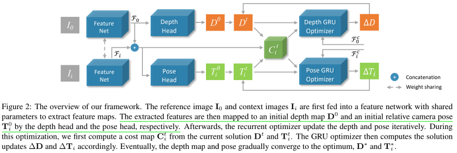
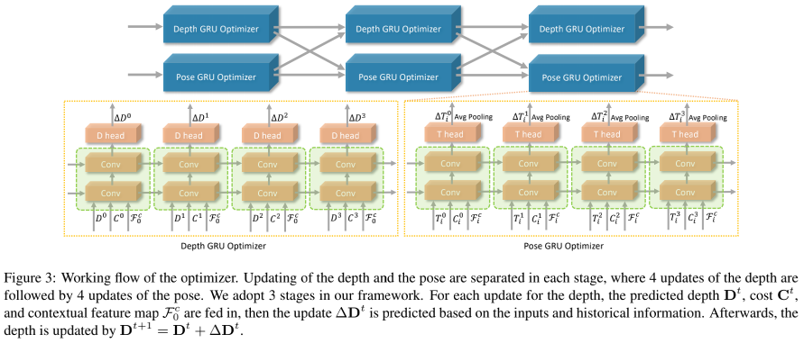
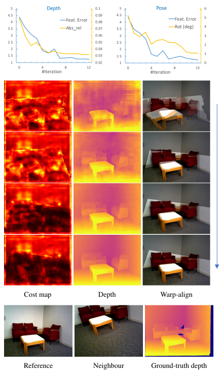

# DRO: Deep Recurrent Optimizer for Structure-from-Motion

## 1. Network architecture

输入是参考帧 $\mathbf{I}_0$ 和 $N$ 张相邻图片 $\{\mathbf{I}_i^N \}$, 输出是参考帧的深度图 $\mathbf{D}$ 和相邻图片的相对 pose $\{ \mathbf{T}_i^N \}$. 图像首先通过参数共享的 FeatureNet 得到 feature map $\mathcal{F}_i$, 然后由 Depth Head 和 Pose Head 将 feature map 作为输入，输出参考帧的初始深度图 $\mathbf{D}^0$ 以及初始的相对 pose $\mathbf{T}_i^0$. 最后, 初始值通过 depth GRU optimizer 和 pose GRU optimizer 交替式地进行迭代优化, 并输出最终的深度图 $\mathbf{D}^{*}$ 和 pose $\mathbf{T}_i^{*}$.

### 1.1 Feature Selection \& Cost Construction

#### (1) Feature Selection
Backbone: ResNet18. feature map 的分辨率是输入图像的 $\frac{1}{8}$. 初始的 hidden state 记为 $h_0$, GRU 的上下文特征 $\mathcal{F}_i^N$ 来自于相同结构的特征网络.

#### (2) Cost Construction

DRO 采取了和 BANet 相似的 photometric cost 作为 cost function. 对于参考帧 $\mathbf{I}_0$ 中的每个像素点 $x$, 误差定义为:

$$
\mathbf{C}_i(x) = || \mathcal{F}_i (\pi(\mathbf{T}_i \cdot \pi^{-1}(x, \mathbf{D}(x)) )) - \mathcal{F}_0 (x)||_2
$$

其中, $\pi^{-1}(x, \mathbf{D}(x))$ 将 $\mathbf{I}_0$ 中的图像坐标转到 $\mathbf{I}_0$ 的相机坐标系下的三维点, 即 $\mathbf{X}_c^0=\pi^{-1}(x, \mathbf{D}(x))$. 然后, $\mathbf{T}_i \cdot \pi^{-1}(x, \mathbf{D}(x))=\mathbf{T}_i \mathbf{X}_c^0$ 将相机系 $\mathbf{I}_0$ 下的三维点转到图像 $\mathbf{I}_i$ 对应的相机系下的三维点 $\mathbf{X}_c^i$. 然后, $ \pi^{-1}$ 又将三维点投影回 $\mathbf{I}_i$ 的图像平面. 最后的误差就是像素点在对应的 feature map 上的差.

当有多帧图片输出时, 误差定义为多幅图像误差的平均值:

$$
\mathbf{C} (x) = \frac{1}{N} \sum_{i=1}{N} \mathbf{C}_i (x).
$$
这里的 $\mathbf{C}(x)$ 称为 cost map. **在交替优化时, camera pose $\mathbf{T}_i$ 通过优化 $\mathbf{C}_i (x)$ 得到; depth map $\mathbf{D}$ 通过优化 cost map $\mathbf{C}(x)$ 得到**.

### (3) 交替优化

在每一步迭代过程中, 优化器按以下方式对结果进行更新:

$$
\mathbf{D}^{t+1} = \mathbf{D}^t + \Delta \mathbf{D}^t,\\
\mathbf{T}^{t+1} = \mathbf{T}_i^t + \Delta \mathbf{T}_i^t.
$$

受 RAFT 的启发, DRO 使用 GRU 来计算更新值, 因为 GRU 可以记住之前步骤的状态并且可以有效地挖掘优化过程中的时序信息.

再来看 DRO 的 depth head 和 pose head. 如上图所示, depth head 和 pose head 的结构相似, 不同的在于 pose head 多了一个 average pooling 层. 更具体来讲, 这两个 head 遵循 GRU 的结构设计. 另 $z, r$ 分别为更新门和重置门, 变量的更新规则如下:

$$
z^{t+1} = \sigma (Conv_{5\times 5}([h^t, \mathbf{M}^t], W_z)),\\
r^{t+1} = \sigma (Conv_{5\times 5}([h^t, \mathbf{M}^t], W_r)), \\
\tilde{h}^{t+1} = tanh(Conv_{5 \times 5}(r^{t+1} \odot h^t, \mathbf{M}^t), W_h), \\
h^{t+1} = (1-z^{t+1}) \odot h^t + z^{t+1} \odot \tilde{h}^{t+1}.
$$

其中, depth map 和 camera pose 从隐状态 $h^t$ 预测得到. 在每一步迭代中, $\mathbf{D}^t$ 和 $\mathbf{T}_i^T$ 是通过交替优化得到: 也就是先固定其中一个, 然后优化另一个; 再固定另一个优化别的. DRO 逐步优化时 cost map 和 depth map 的优化效果如图:

### 1.2 Training Loss

DRO 的分别为有监督和自监督设计了 loss.

#### (1) Supervised Case

$$
\mathcal{L}_{depth} = \sum_{s=1}^m \gamma^{m-s} \| \mathbf{D}^s - \hat{\mathbf{D}} \|_1, \\
\mathcal{L}_{pose} = \sum_{s=1}^m \sum_x \gamma^{m-s} \| \pi (\mathbf{T}_i^s \circ \pi^{-1} (x, \hat{\mathbf{D}}(x)) - \pi (\hat{\mathbf{T}}_i \circ \pi^{-1} (x, \hat{\mathbf{D}} (x))) \|_1,
$$

其中的 $\gamma^{m-s}$ 可以控制权重在优化过程中逐步减小.

最后的loss 为:
$$
\mathcal{L}_{supervised} = \mathcal{L}_{depth} + \mathcal{L}_{pose}.
$$

#### (2) Self-supervised Case

这部分的 loss 设计是参考的别的文献, 目前没有太理解, 之后再来填坑.

## 2. 实验

DRO 分别在 KITTI ScanNet, SUN3D, RGB-D SLAM 和 Scenes11等数据上进行了评测. 效果比之前的所有方法都要好(这里有一篇 CVPR 2021 同期的工作: [Deep Two-View Structure-from-Motion Revisited](https://arxiv.org/pdf/2104.00556.pdf) 在这些数据集上表现不如 DRO).

## Further Readings

- [RAFT: Recurrent All Pairs Field Transforms for Optical Flow](https://arxiv.org/pdf/2003.12039.pdf)