# A Review of Deep Structure-from-Motion Methods

## 1. DeMoN: Depth and Motion Network for Learning Monocular Stereo

DeMoN 是 deep sfm 里具有奠基性的一个工作。总的来讲这篇工作在当时还是很有意思的，缺点是深度和 pose 的估计比较独立，没有利用几何约束，网络的泛化性不够好.
DeMoN 主要采用的是 encoder-decoder 架构。具体由三个网络组成: boostrap net, iterative net, refinement net.

  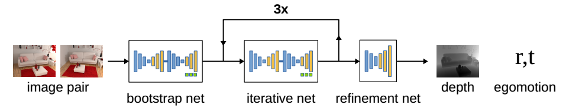
     
    
DeMoN 的网络架构. 

其中 boostrap net 和 iterative net 的架构非常相似，区别在于依赖的输入不一样。

### 1.1 boostrap net

bootstrap net 的输入是两张图片，输出是 depth 和 motion. 
**第一个 encoder-decoder**: encoder 首先逐步对图片降采样同时增加通道数，然后decoder对图片进行上采样并减少通道数， 然后输出 optical flow 和 confidence map.
**第二个 encoder-decoder**: 第二个 encoder-decoder 和前一层的 encoder-decoder 架构类似，不同的是这时的 encoder 的输入是前一层 encoder-decoder 得到的 optical flow, confidence map, 图片对，以及用估计的 optical flow warp 得到的第二张图片. 输出是 depth, surface normals, camera pose. 注意 camera pose 是通过三个全连接层得到 (除了camera pose 之外，这三个全连接层还同时估计 scale $s$).

  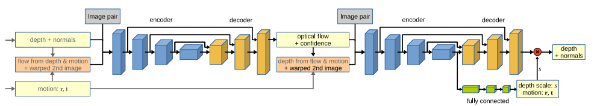
     
    
bootstrap net 和 iterative net 的网络架构. 

### 1.2 iterative net

iterative net 用于进一步优化 boostrap net 得到的 depth, normal, camera pose. 它的架构和 bootstrap net 非常相似，不同在于: 对于第一个 encoder-decoder, iterative net 的输入除了图片对之外，还有 bootstrap net 或者是前一次 iterative net 迭代得到的 depth 和 camera pose; 对于第二个 encoder-decoder, optical flow 通过前面估计得到的 camera pose 转化为 depth map作为输入. 从下图就可以看出 iterative net 对 boostrap net 的提升.

  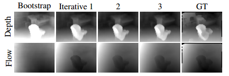
     
    
iterative net 对 bootstrap net 结果的提升. 

### 1.3 refinement net

论文里提到: 对于前面的 encoder-decoder 网络, 为了节约训练和测试时间，是在降低分辨率后的 $64 \times 48$ 大小的图片上操作的. 因此，这个时候需要一个额外的 refinement net 来将结果上采样到最终的完整的 $256 \times 192$ 大小的图片分辨率.

  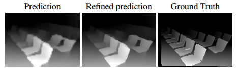
     
    
refinement net 优化后的 depth map. 

### 1.4 depth 和 camera pose 的参数表示

旋转 $\mathbf{R}$ 采用轴角表示： $\mathbf{R}= \theta \mathbf{v}$, 平移 $\mathbf{t}$ 不用解释.
除此之外，depth $z$ 采用的是逆深度 $\delta = \frac{1}{z}$ 来表示。

### 1.5 数据集

SUN3D, RGB-D SLAM, MVS, Scenes11, NYUv2

### 1.6 评价指标

需要对深度和 pose 分别进行评估.
对于深度的评价, 主要有 sv-inv, L1-rel, L1-inv这三个指标. sc-inv 是用于和 single-image 的方法进行比较的，这类方法能恢复到世界尺度下的深度, 因此需要一个 scale-invariant 的误差指标:
$$
\begin{align}
& \text{sc-inv}(z, \hat{z}) = \sqrt{\frac{1}{n} \sum_i d_i^2 - \frac{1}{n^2} (\sum_i d_i)^2 }, d_i = \log(z_i) - \log(\hat{z}_i).
\end{align}
$$

L1-rel, L1-inv 是用于和传统的基于几何方法的 structure-from-motion 算法比较的. 其中 L1-rel 计算的是估计得到的 depth 相比于 ground truth depth 的误差, 因此当 ground truth 较大时能够给出较小的误差值，除此之外还能够体现深度较小的物体的重要性; L1-inv 计算的是逆深度的误差:
$$
\begin{align}
& \text{L1-rel}(z, \hat{z}) = \frac{1}{n} \sum_i \frac{|z_i - \hat{z}_i|}{\hat{z}_i}, \\
& \text{L1-inv}(z, \hat{z}) = \frac{1}{n} \sum_i |\delta_i - \hat{\delta}_i| = \frac{1}{n} \sum_i |\frac{1}{z_i} - \frac{1}{\hat{z}_i}|
\end{align}
$$

## 2. BA-NET: Dense Bundle Adjustment Networks

前面提到 DeMoN 非常明显的一个缺点就是 depth 网络和 pose 网络是互相独立而且缺乏几何约束的. BA-Net 则考虑了几何约束. 这篇文章的思路和网络架构则是围绕怎么构建这个几何约束来做的. 

### 2.1 网络架构
下图是 BANet 的网络架构: 首先是 DRN-54 作为 backbone 提取图片中的 feature map, 对每一层 feature map 拼接得到 feature pyramids 作为 BALayer 的输入. 之后，对于参考帧图片 $I_1$, BANet 使用 depth map generator 生成 128 个 depth map basis, 这些 depth map basis 合并作为最终的深度图. 最后, feature pyramids 和 depth map 都作为 BALayer 的输入进行迭代优化.

  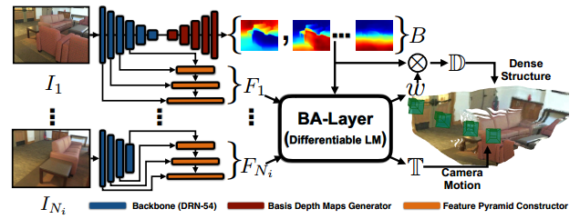
     
    
BANet 的网络架构. 

### 2.2 Feature Pyramids

传统的 SfM 都会使用重投影误差作为代价函数，然后通过 BA 对 pose 和点云进行优化. 问题在于对于端到端的神经网络，需要怎么构建这样一个约束: 我们需要点云, camera pose, 以及可微分的 BA 算法来优化点云和 pose. 点云需要知道点的深度, 这里有两个要素: 点和深度图. 这篇论文没有使用传统的基于角点的特征，也没有使用直接法 SLAM 中使用的 photometric BA 中使用的大量像素点。因为基于角点的特征比较稀疏，提供给网络的有效信息太少，而 photometric BA 对移动的物体、曝光和白平衡的变化非常敏感. 这篇论文的一个 novelty 就是**使用深度网络中的 feature map 来作为重投影误差中的像素点** (***这点我觉得和 ICCV 2021 best student paper 中使用 feature map 来对齐特征点有相似之处，也许可以在这方面做点工作***) 使用 feature map 进行重投影的误差我们称为 featuremetric error:
$$
e^f_{i, j} (\mathcal{X}) = F_i \left( \pi \left( \mathbf{T}_i, d_j \cdot \mathbf{q}_j \right) \right)  - F_1 (\mathbf{q}_j),
$$
其中 $\mathbb{F} = \left\{ F_i | i=1,\cdots, N_i \right\}$ 为对应于图片 $\mathbb{I} = \left\{ I_i | i=1, \cdots, N_i \right\}$ 的 feature pyramids. 下图可以看到 feature pyramids 的构建过程. 其中每一层的 $F^k$ 都是通过对第 k 层的 feature map $C^k$ 和下一层的 feature map $C^{k+1}$ 上采样两倍之后拼接得到.

  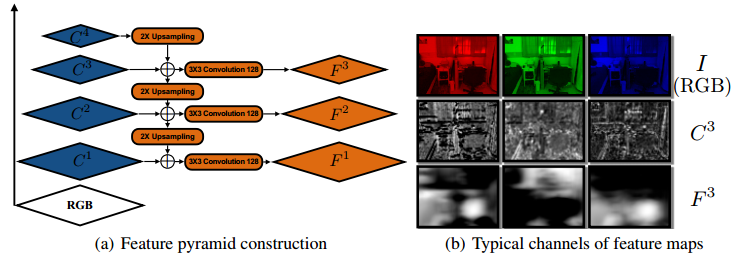
     
    
feature map 的构建过程. 

下图对两张图片不同位置的 feature map 计算得到的 distance 进行了可视化, 可以看到 (d) 图有明显的极大极小值, 因此对于之后的 BALayer 的优化是非常有帮助的.

  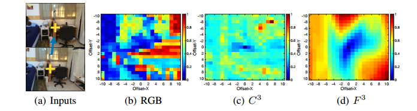
     
    
feature distance map 的可视化结果. 

### 2.3 Bundle Adjustment Layer

传统的 BA 一般使用 LM 算法进行优化, 但是原来的 LM 算法不可微, 因为它在判断是否收敛时和更新 damp factor $\lambda$ 的时候有 if-else 条件语句. 为了让 LM 算法可微, BANet 对 LM 算法进行了改造: (1) 设置固定的迭代次数替换收敛条件的判断: (2) 将当前的在所有 $N_i$ 张图片上的 $N_j$ 个像素的 feature-metric error $E(\mathcal{X}) = [e_{1, 1}^f(\mathcal{X}), e_{1, 2}^f(\mathcal{X}), \cdots,\ e_{N_i, N_j}^f(\mathcal{X})]$ 作为输入, 通过三个全连接层回归出 damp factor $\lambda$. BALayer 的具体架构如下:

  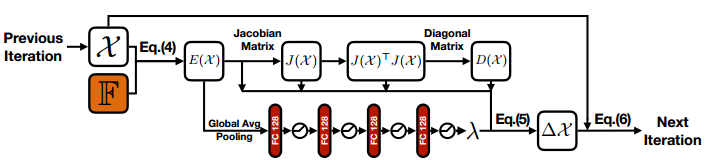
     
    
BALayer 的网络架构. 

通过 BALayer, 我们就能够对变量进行更新了.

### 2.4 Basis Depth Maps Generation
BANet 使用了一个 encoder-decoder 的架构来生成 basis depth maps. 其中 encoder 采用 DRN-54 提取得到 feature pyramids, decoder 的最后一层卷积层输出 128 通道的 feature maps 作为 basis depth maps. 最终的 depth map 为 basis depth maps 的线性组合:
$$
\mathbb{D} = \text{ReLU} (\mathbf{w}^{\top} \mathbf{B}),
$$

其中, $\mathbb{D}$ 是大小为 $h \cdot w$ 的 depth map, $\mathbf{B}$ 为 $128 \times h\cdot w$ 大小的矩阵, 表示 128 个从网络中生成的 basis depth maps, $\mathbf{w}$ 是网络更新的权重. 因此, 最终 BALayer 的代价函数为:

$$
e^f_{i, j} (\mathcal{X}) = F_i \left( \pi \left( \mathbf{T}_i, \text{ReLU} (\mathbf{w}^{\top} \mathbf{B}[j]) \cdot \mathbf{q}_j \right) \right)  - F_1 (\mathbf{q}_j),
$$

为了加速收敛, 初始的权重 $\mathbf{w}_0$ 是通过 1D 的卷积核学习得到的. 下图对一些不同图片的 basis depth maps 进行了可视化.

  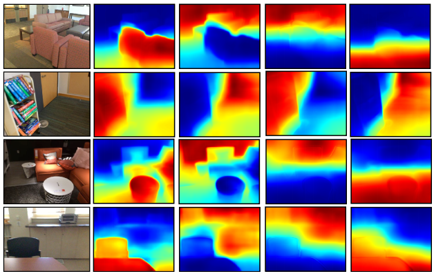
     
    
不同图片的 basis depth maps

## 3. DeepSFM: Structure From Motion Via Deep Bundle Adjustment

DeepSFM 的主要思路则是通过构建两个 cost volume 来设计网络的, 其中 depth 和 pose 各需构建一个 cost volume. 
和 DeMoN 以及其他 monocular depth estimation 的网络设计不同, DeepSFM 的 depth 和 pose 是相互依赖且耦合的, 而之前主要的工作 depth 和 pose 基本是通过较为独立的网络估计得到. 如下图所示:

  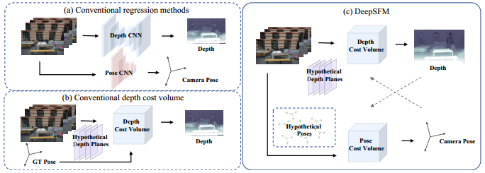
     
    
DeepSFM 和其他网络的不同之处

DeepSFM 的网络结构如下. 其中 feature extraction 先通过一个 7 层的 CNN 卷积，然后 SPP 作为 backbone 来提取 feature map 的. 对于 source image 和 target image, 都会使用相同的 feature extraction 来提取 feature map, 然后作为输入分别提供给 depth cost volume 和 pose cost volume.

  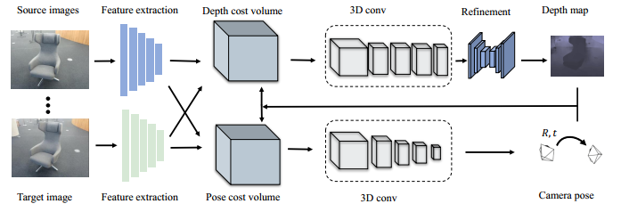
     
    
DeepSFM 的网络架构.

### 3.1 Depth Cost Volume

Depth cost volume 的设计能够使得网络利用 ***geometric consistency*** 约束以及 ***photometric consistency*** 约束来提升网络性能和泛化性. Depth cost volume 的设计借鉴了 MVS 中 plane sweep 算法的思路: 首先在逆深度空间均匀采样 $L$ 个虚拟平面 $\{d_l\}_{l=1}^L$. 接着, 大小为 $C\times W \times H$ feature maps $\mathbf{F}_i$ 可以通过相机内参和初始的 camera pose $\{\mathbf{R}_i^{*}, \mathbf{t}_i^{*}\}$ warp 到之前采样的虚拟平面 $d_l$ 上:

$$
\tilde{\mathbf{F}}_{il} (u) = \mathbf{R}_i (\tilde{u}_l), \tilde{u}_l = \mathbf{K}[\mathbf{R}_i^{*} | \mathbf{t}_i^{*}] \left[
    \begin{array}{c}
    \left( \mathbf{K}^{-1} u \right) d_l \\
    1
    \end{array}
\right],
$$
其中 $\tilde{\mathbf{F}}_{il} (u)$ 为 source image 的 feature map 被 warp 到第 $l$ 个深度平面上的 feature map. 最后, 将 target image 的 feature map 和 warp 后得到的 feature map 拼接在一起, 我们可以得到维度为 $2C \times L \times W \times H$ 的 feature volume. **由于这里的 feature volume 的构建利用了 plane sweep 算法, 因此可以利用 photometric consistency 来验证将 source image warp 到 target image 后的 feature map 和 target image 的 feature map 的光度一致性**.

为了进一步利用 geometric consistency, 对于每个深度平面, DeepSFM 还增加了两个通道(这两个通道也称为 depth consistency map): (1) **将 source image 的初始 depth map (第一次由 DeMoN 得到, 之后的由网络更新得到) warp 到 target image 下**; (2) **将深度为 $d_l$ 处的点投影到 source image 下的点得到的 depth map**. 其中 depth image 的 warp 和 feature map 的 warp 类似, 不同之处在于 feature map 的 warp 采用双线性插值, 而 depth image 的 warp 用最近邻采样. 而对于 (2) 则只需应用投影公式:

$$
T(d_l) = [\mathbf{R}_i^{*} | \mathbf{t}_i^{*}] \left[
    \begin{array}{c}
    \left( \mathbf{K}^{-1} u \right) d_l \\
    1
    \end{array}
\right].
$$

对于所有的深度平面使用相同的操作, 我们可以得到维度为 $2\times L \times W \times H$ 的 depth volume.
最后, 将前面得到的 feature volume 和这里的 depth volume 拼接起来, 就得到了最终的维度大小为 $(2C + 2) \times L \times W \times H$ 的 depth cost volume (D-CV).

### 3.2 Pose Cost Volume

Pose cost volume 的构建是为了通过 photometric consistency 和 geometric consistency 来优化 camera pose. 和 depth cost volume 类似, pose cost volume 包含: target image 的 feature map, source image 被 warp 到 target image 后的 feature map, depth consistency map. 为了更新 camera pose, DeepSFM 对 rotation 和 translation 分别进行了均匀采样, 其中 rotation 采用欧拉角表示, 采样方式如下图所示:

  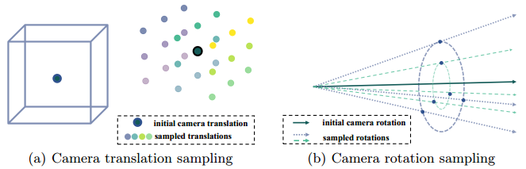
     
    
Pose cost volume 中对 pose 更新量 $\delta P$ 的均匀采样.

在采样 $P$ 个 pose 之后, camera pose 可以更新为 $\left\{ \mathbf{R}_{ip}^{*} | \mathbf{t}_{ip}^{*}  \right\}_{p=1}^P$. 然后, 通过这 $P$ 个 camera pose 分别对 feature map 进行 warp:
$$
\tilde{u}_p= \mathbf{K}[\mathbf{R}_{ip}^{*} | \mathbf{t}_{ip}^{*}] \left[
    \begin{array}{c}
    \left( \mathbf{K}^{-1} u \right) \mathbf{D}_i^{*} \\
    1
    \end{array}
\right],
$$
这里的 $\mathbf{D}_i^{*}$ 为 target image 的初始 depth. 和 depth cost volume 类似, 我们最终可以得到一个维度为 $(2C+2) \times P \times W \times H$ 的 cost volume.

### 3.3 Loss function
最终训练的 loss function 为:
$$
\begin{align}
& \mathcal{L}_{\text{final}} = \lambda_r \mathcal{L}_{\text{rotation}} + \lambda_t \mathcal{L}_{\text{translation}} + \lambda_d \mathcal{L}_{\text{depth}}, \\
& \mathcal{L}_{\text{depth}} = \sum_i \lambda H(\hat{D}_i^0, \mathbf{D}_i) + H(\hat{D}_i, \mathbf{D}_i)
\end{align}
$$
其中 $\hat{D}_i^0, \hat{D}_i$ 分别为预测的 coarse depth map 和 refine 后的 depth map. 这里的初值是通过 DeMoN 网络得到的.

### 3.3 实验对比

  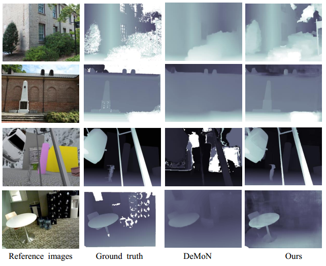
     
    
DeepSFM 和 DeMoN 的结果对比.

  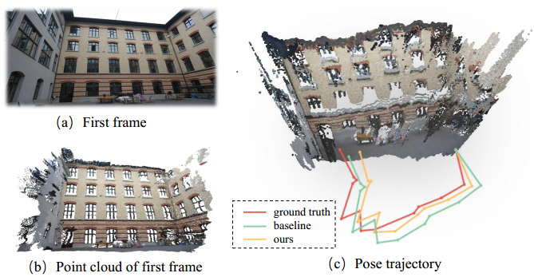
     
    
DeepSFM 在 ETH3D 数据集上和 baseline 对比.

  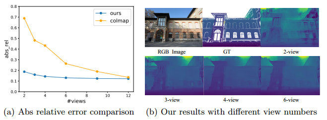
     
    
DeepSFM 使用更多视图的结果对比.

## 4. Deep Two-View Structure-from-Motion Revisited

和之前的工作相比, Deep two-view SfM 则更偏传统方法, 唯一依赖了网络的地方就是通过 deep optical flow 来获取 correspondences, 进而通过 RANSAC + 五点法来计算相对 pose. 下图是 deep two-view SfM 的 pipeline 和其他方法的一些对比, 其中 Type I 是 monocular depth 和 ego-motion estimation 的一类方法, Type II 是以上介绍的利用了 geometric constraints 或者 photometric constraints 的一类方法.

  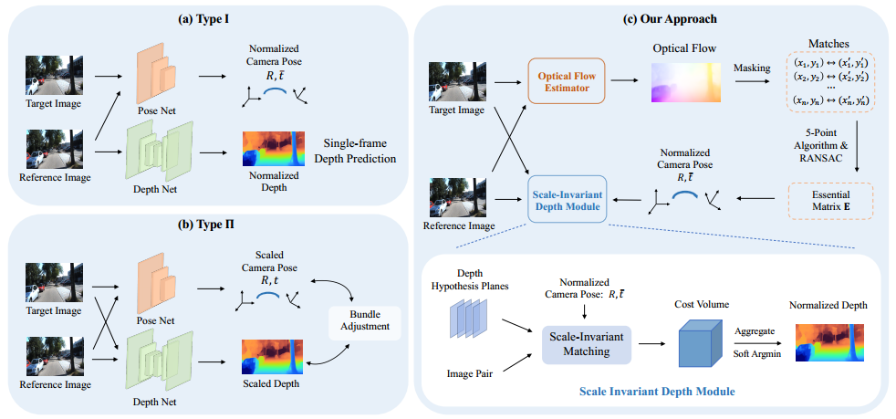
     
    
Deep Two-View SfM 的 pipeline 和 其他类型方法的比较.

### 4.1 Relative Pose Estimation

传统五点法估计相对 pose 的第一步是获取 correspondences, 这一步我们可以通过先找特征点然后再做匹配的方法来得到, 齐次也可以通过 optical flow 来获取. 这篇论文采用的是 deep optical flow 的方法来获取的. deep optical flow 相比传统基于特征点 match 的方法相比在 non-Lambertial, blurry, texture-less 的场景更准确. 有了 correspondences 之后, 就可以通过 RANSAC + 五点法计算 pose 了. 但是这里还有一个问题: dense matches 仍然包含很多 noise matches, 我们怎么去移除这些错误的 match 也很重要. 这篇论文使用了 SIFT 生成 mask, 只有在 mask 里的 optical flow matches 才会使用 RANSAC 来估计 relative pose.

### 4.2 Scale Invariant Depth Estimation

有了 pose 和 dense matches 之后, 我们就可以通过 triangulation 来估计 depth map 了. 但是这样的话就没有利用到 epipolar constraint. deep two-view SfM 通过类似于 plane sweep 的方法来计算深度:

$$
\mathbf{x}^{'}_l = \mathbf{K} [\mathbf{R} | \mathbf{t}] \left[
    \begin{array}{c}
    \left( \mathbf{K}^{-1} \mathbf{x} \right) d_l\\
    1
    \end{array}
\right],
$$
其中 $d_l=(L \times d_{\min}) / l, (l=1, \cdots, L)$ 是均匀采样的 depth, $d_{\min}$ 是固定的最小深度. 和 plane sweep 不同的是, 由于 relative poses 是缺少 scale 的, 如果用不同的 scale 来做 plane sweep, 那么变换后的点的分布就是非常不一致, 如下图所示 (其中 $\alpha = \|\mathbf{t}\|_2$):

  
     
    
不同尺度因子会导致不同的对应点的分布.

为了让 depth 对不同 scale 的 pose 也能保持一致, 这里的 $\mathbf{t}$ 进行了归一化. 注意这个时候估计的 depth 不是在真实尺度下, 为了和 ground truth 比较, 需要需要将 depth 进行 scale 到和真实尺度一致:

$$
\mathbf{d}x = \alpha_{\text{gt}} \hat{\mathbf{d}},
$$
其中 $\alpha_{\text{gt}}$ 是 ground truth scale.

### 4.3 Loss Function

(1) 对应于 depth 的 loss:
$$
\mathcal{L}_{\text{depth}} = \sum_\mathbf{x} l_{\text{huber}} (\alpha_{\text{gt}} \hat{\mathbf{d}}_{\mathbf{x}} - \mathbf{d}_{\mathbf{x}}).
$$

(2) 对应于 optical flow 的 loss:
$$
\mathcal{L}_{\text{flow}} = \sum_{\mathbf{x}} (\hat{\mathbf{u}}_{\mathbf{x}} - \mathbf{u}_{\mathbf{x}})^2,
$$
其中 $\mathbf{u}_{\mathbf{x}}=\mathbf{x}^{'} - \mathbf{x}$. 

最终的 loss 为 $\mathcal{L}_{\text{final}}=\mathcal{L}_{\text{depth}} + \lambda \mathcal{L}_{\text{flow}}$.

### 4.4 一些结果

  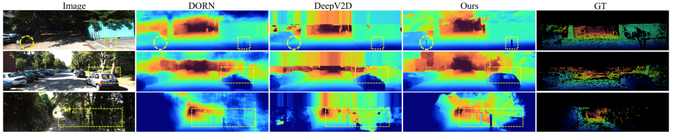
     
    
KITTI Depth 数据集上的比较.

  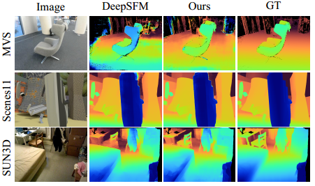
     
    
DeMoN数据集上的比较.

