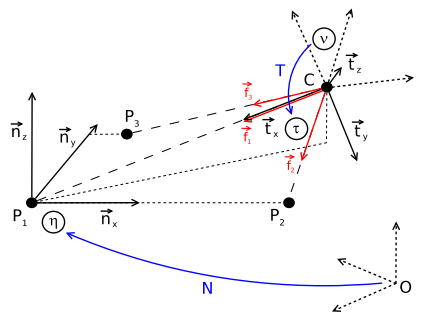
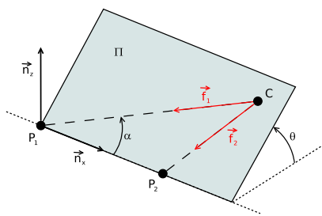

# Perspective-n-Point (PnP)

## 1. Perspective-3-Point (P3P)

P3P解决的是已知三组2D-3D对应点以及相机内参的情况下，如何求解相机姿态的问题。因此，我们可以考虑从图像平面指向三维点的三个单位向量 $f_1, f_2, f_3$ 已知，如下图所示:

### (1) 中间坐标系的定义
记原始的相机坐标系为 $\nu$，第一步从特征向量 $f_1, f_2$ 定义一个新的、中间相机坐标系 $\tau$，如下图所示:

新的相机坐标系表示为 $\tau = (C, t_x, t_y, t_z)$, 其中:

$$
t_x = f_1 \qquad\quad\\
t_z = \frac{f_1 \times f_2}{||f_1 \times f_2||}\\
t_y = t_z \times t_x\quad \ \ \tag{1}  
$$

显然，以这样的方式，能够通过 $f_1, f_2$构造出一个三维直角坐标系。令 $T = [t_x, t_y, t_z]^T$，特征向量可以变换到 $\tau$:

$$
f_i^{\tau} = T \cdot f_i \tag{2}
$$

### (2) 世界坐标系的定义

第二步需要通过三个 world points $P_1, P_2, P_3$ 定义一个新的世界坐标系 $\eta$，令$P_1$ 为世界坐标系原点，则新的空间坐标系定义为 $\eta = (P_1, n_x, n_y, n_z)$，其中

$$
\overrightarrow{n_x} = \frac{\overrightarrow{P_1P_2}}{||\overrightarrow{P_1P_2}||}\quad \\
\overrightarrow{n_z} = \frac{\overrightarrow{n_x} \times \overrightarrow{P_1P_3}}{\overrightarrow{n_x} \times \overrightarrow{P_1P_3}}\\
\overrightarrow{n_y} = \overrightarrow{n_z} \times \overrightarrow{n_x} \quad
\tag{4}
$$

通过变化矩阵 $N=[\overrightarrow{n_x}, \overrightarrow{n_y}, \overrightarrow{n_z}]^T$，世界坐标系的点可以变换到$\eta$:

$$
P_i^{\eta} = N \cdot (P_i - p_1) \tag{5}
$$

如果我们能够定义 $\tau$ 到 $\eta$ 的方向，那么 $\eta$ 的方向就通过 $N$ 在世界坐标系的内部自动给出了，并且通过 $T$ 我们就能得到 $\nu$ 的方向。对于相机中心 $C$ 来说我们也可以通过类似的方式得到，如上图2所示。

需要注意的是，$\eta$ 的定义是合法的需要 $P_1, P_2, P_3$ 满足不共面的条件。通过检验 $\overrightarrow{P_1P_2} \times \overrightarrow{P_1P_3}$ 我们可以很容易验证这一条件。

### (3) 世界坐标系到中间相机坐标系的变换

第三步，我们需要计算如何从世界坐标系变换到中间相机坐标系。首先定义一个包含 $P_1, P_2, C$ 和 单位向量$\overrightarrow{n_x}. \overrightarrow{t_x}, \overrightarrow{t_y}, \overrightarrow{f_1}, \overrightarrow{f_2}$ 的半平面 $\Pi$。点 $P_1, P_2, C$ 形成了一个三角形，$P_1, P_2$ 之间的距离 $d_{12}$ 已知，$\overrightarrow{f_1}$ 和 $\overrightarrow{f_2}$ 之间的夹角 $\beta = \overrightarrow{f_1} \cdot \overrightarrow{f_2}$ 也已知，如下图所示:

由于之后的参数依赖于 $\beta$，因此这里定义一个参数 $b$ 简化之后的符号表示:

$$
b = cot \beta = \pm \sqrt{\frac{1}{1 - cos^2 \beta} - 1} = \pm \sqrt{\frac{1}{1 - (\overrightarrow{f_1} \cdot \overrightarrow{f_2})^2} - 1} \tag{6}
$$

$b$ 的符号取决于 $cot \beta$ 的符号。令 $\alpha = \angle P_2P_1C \in [0, \pi]$。由正弦定理，我们有

$$
\frac{\overrightarrow{CP_1}}{d_{12}} = \frac{sin(\pi - \alpha - \beta)}{sin \beta}
$$

因此，相机中心 $C$ 在平面 $\Pi$ 上的位置为

$$
C^{\Pi}(\alpha) = (||\overrightarrow{CP_1}|| \cdot cos\alpha, ||\overrightarrow{CP_1}|| \cdot sin\alpha, 0)^T \qquad\qquad\qquad\qquad\qquad\qquad\qquad\qquad\\
= (d_{12}\ cos\alpha\ sin(\alpha + \beta)\ sin^{-1}\beta, d_{12}\ sin\alpha\ sin(\alpha + \beta) sin^{-1}\beta,\ 0)^T\\
= (d_{12}\ cos\alpha\ (sin\alpha\ cot\beta\ + cos\alpha), d_{12}\ sin{\alpha}(sin\alpha\ cot\beta\ + cos\alpha), 0)^T\\
= (d_{12}\ cos\alpha (sin\alpha \cdot b + cos\alpha),\ d_{12}\ sin\alpha (sin\alpha \cdot b + cos\alpha),\ 0)^T \qquad \tag{8}
$$

因此，$\tau$ 在平面 $\Pi$ 内的基向量可以很容易得到: $\overrightarrow{t}^{\Pi}_x = (-cos \alpha, -sin\alpha, 0)^T, \overrightarrow{t}^{\Pi}_y = (sin\alpha, cos\alpha, 0)^T, \overrightarrow{t}^{\Pi}_z = (0, 0, 1)^T$。为了让 $C, \overrightarrow{t_x}, \overrightarrow{t_y}, \overrightarrow{t_z}$ 能够在　$\eta$ 里表示出来，我们需要考虑第二个自由参数，也就是平面 $\Pi$ 绕 $\overrightarrow{n_x}$ 的转角 $\theta$。如下图所示:

对应的旋转矩阵为

$$
R_{\theta} =
\left[
\begin{array}{ccc}
1 & 0 & 0\\
0 & cos\theta & -sin\theta\\
0 & sin\theta & cos\theta
\end{array}
\right]
$$

如果 $f_{3,z}^{\tau} < 0$，那么 $\theta \in [0, \pi]$；如果 $f_{3,z}^{\tau} > 0$，那么 $\theta \in [-\pi, 0]$，其中 $f_3^{\tau}$ 由 $f_3$ 通过 (1) 得到。因此，相机中心在 $\eta$ 内的坐标为:

$$
C^{\eta}(\alpha, \theta) = R_{\theta} \cdot C^{\Pi}, \\
= (d_{12} cos\alpha(sin\alpha \cdot b + cos\alpha), d_{12}\ sin\alpha\ cos\theta\ (sin\alpha \cdot b + cos\alpha), d_{12}\ sin\alpha\ sin\theta(sin\alpha \cdot b + cos\alpha)) \tag{9}
$$

从 $\eta$ 到 $\tau$ 的变换矩阵为:

$$
Q(\alpha, \theta) = [R_{\theta}\cdot (\overrightarrow{t}^{\Pi}_x\overrightarrow{t}^{\Pi}_y\overrightarrow{t}^{\Pi}_z)]^T = \left[
\begin{array}{ccc}
-cos\alpha & -sin\alpha\ cos\beta & -sin\alpha\ sin\theta\\
sin\alpha & -cos\alpha\ cos\theta & -cos\alpha\ sin\theta\\
0 & -sin\theta & cos\theta
\end{array}
\right]
\tag{10}
$$

为了找到 $\alpha$ 和 $\theta$ 的正确的值，我们可以通过把 $P_3^{\eta}$ 投影到 ${\tau}$　中。由公式(5)，我们知道 $P_3^{\eta} = (p_1, p_2, 0)^T$，我们有

$$
P_3^{\tau} = Q(\alpha, \theta) \cdot (P_3^{\eta} - C^{\eta}(\alpha, \theta))
= \left[
\begin{array}{c}
-cos\alpha \cdot p_1 - sin\alpha cos\theta \cdot p_2 + d_{12}(sin\alpha \cdot b + cos\alpha)\\
sin\alpha \cdot p_1 - cos\alpha\ cos\theta \cdot p_2\\
-sin\theta \cdot p_2
\end{array}
\right]
\tag{11}
$$

定义
$$
\phi_1 = \frac{f_{3,x}^{\tau}}{f_{3,z}^{\tau}}, 
\phi_2 = \frac{f_{3,y}^{\tau}}{f_{3,z}^{\tau}}
\tag{12}
$$

我们可以得到 (这里的推导过程省略，具体见参考文献)
$$
cot \alpha = \frac{\frac{\phi_1}{\phi_2}p_1 + cos\theta \cdot p_2 - d_{12} \cdot b}{\frac{\phi_1}{\phi_2}cos\theta \cdot p_2 - p_2 + d_{12}}
\tag{13}
$$

以及

$$
(1 - cos^2 \theta)(1 + cot^2 \alpha)f_2^2p_2^2 = p_1^2 - 2cot\alpha\ cos\theta \cdot p_1 p_2 + cot^2\alpha\ cos^2\theta \cdot p_2^2 \tag{14}
$$

将公式(13) 代入 (14)，可得
$$
a_4\cdot cos^4\theta + a_3 \cdot cos^3\theta + a_2\cdot cos^2\theta + a_1 \cdot cos\theta + a_0 = 0 \tag{15}
$$
其中，
$a_0, a_1, a_2, a_3, a_4$是由 $p_1, p_2, \phi_1, \phi_2, d_{12}, b$组成的多项式解，由于太长不列出，具体形式可见文献。
公式(15)有Ferrari闭式解。在得到$\alpha, \theta$的解之后，代入 (9) 和 (10)，我们就能得到相机中心以及旋转了:

$$
C = P_1 + N^T \cdot C^{\eta} \tag{16}
$$

$$
R = N^T \cdot Q^T \cdot T \tag{17}
$$

