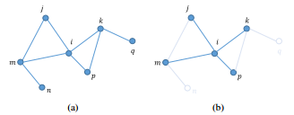
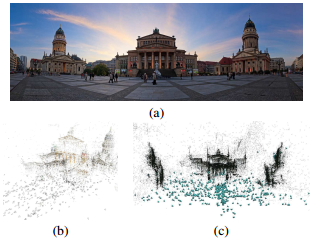
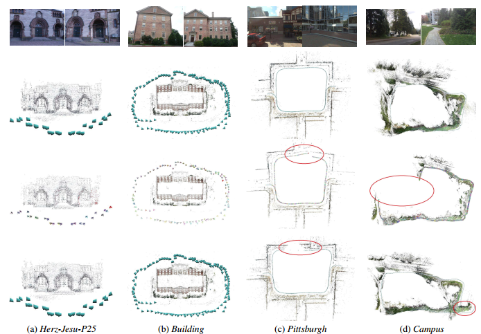

# Survey of Global Structure from Motion

## 1. Global Structure-from-Motion by Similarity Averaging
之前所有的global SfM方法都分为四步：Rotation Averaging, Translation Averaging, Triangulation, Bundle Adjustment。但是，众所周知的是，translation averaging这一步很难做好，主要有两个原因: essential matrix只能估计的relative translation只有方向，没有尺度；很难剔除所有的outlier导致的bad essential matrix。这篇文章的方法则拓宽了思路，如果知道尺度的话，那么global translation的估计就容易的多了。为此，这篇文章通过卫星图构建的局部重建为每张图片生成一张稀疏深度图，通过稀疏深度图来估计图片之间相对尺度。

### 1.1 方法概述
这篇文章的pipeline如下：

首先通过特征点匹配之后得到的correspondences计算essential matrix，由于essential matrix只能在parallel rigid graph中确定相机位置，因此这篇文章通过从stellate graph构造为每张图片都构造一张深度图来提升global SfM方法。stellate graph如下图(b)所示: 

在构造稀疏深度图的时候还会通过depth consistency check来去除noisy essential matrices。除此之外，还有两个可选的筛除outlier的步骤: `local BA`用于local stellate graph来提升relative motion的准确性并且筛除一些错误的essential matrices；`missing correspondence analysis`用于排除由于重复的场景结构造成的outlier essential matrices。之后，Rotation Averaging和Scale Averaging同时进行。一旦global rotation和global scale都确定了，scale-aware translation averaging(尺度已知的translation averaging)就可以用于估计global scale了。最后，triangulation之后通过BA来同时优化相机姿态和三维点。

### 1.2 稀疏深度图的构建
对于epipolar graph中的每一条边，我们都已经通过triangulation计算得到一个局部重建，基线宽度设为1。之后，可以通过一个卫星图将这些局部重建拼接起来。这个卫星图不包括环，因此这一步骤简单且鲁棒。为了考虑计算效率，只最多考虑和$i$相连的80个相机。这些相机之间的边是匹配数最多的。对于卫星图之间的局部重建，只需要对图片(i, j)之间计算一个相对尺度$s_{ij}^i$就能将这些局部重建拼接起来。这里的上标$i$表示以$i$为卫星图的中心。对于图片$i$中的一个特征点，如果它同时在$(i, j)$和$(i, k)$中都重建出来了，他的深度和这两个局部重建之间的尺度关系为:

$$
\frac{s_{ik}^i}{s_{ij}^i} = \frac{d_{ij}}{d_{ik}} = d_{jk}^k \tag{1}
$$

其中，$d_{ij}$ 和 $d_{ik}$分别是特征点从$(i, j)$和$(i, k)$中重建出来的。对公式(1)的两边同时取对数，则有

$$
log(s_{ik}^i) - log(s_{ij}^i) = log(d_{jk}^i) \tag{2}
$$

把所有这些线性方程收集起来，可以得到一个线性方程组
$$
Ax=b \tag{3}
$$
其中 $x$ 和 $b$ 分别是把 $log(s_{ij}^i)$ 和 $log(d_{jk}^i)$ 堆叠在一起的向量。为了对(3)进行鲁棒估计，可以通过在 $L_1$-范数意义下进行优化:

$$
\argmin_x ||Ax-b||_1 \tag{4}
$$
$L_1$优化是凸函数可以得到全局最优解，可以通过ADMM进行求解。

#### 1.2.1 Depth consistency check
将这些局部重建合并在一起会造成 $i$ 中的每个特征点有多个深度值。可以通过检验它们的一致性来筛选outlier essential matrices。所有深度值偏离中值滤波之后的深度值的5%都被当做outlier。如果图片对$(i, j)$中的inlier少于5，那么这个图片对将被移除，因为一个本质矩阵需要至少5个点来计算得到。

#### 1.2.2 missing correspondence analysis
missing correspondence analysis已经在一些文献中证明，对于有large repetitive scene structures是一种有效的筛除outlier EG的策略。这篇文章将深度图$D_i$中的三维点都投影到$j$的图像平面中，如下图所示:

其中绿色的点表示在$j$中匹配上的特征点。红色的点是`missing correspondences`，也就是在$j$中没有匹配上的点。可以通过分析红色点和绿色点的比例来移除repetitive scene structures中的outlier epipolar graph。绿虚线框中的红点是由于feature matching的imperfect repeatability造成的，因此，这篇文章只考虑框外的红色点。对于$M_j^i = \frac{n_{red}}{n_{green}}$，如果$M_j^i > \epsilon$，$(i, j)$就被当成outlier被移除掉。

### 1.3 Similarity Averaging
一旦深度图构建完成，对于epipolar graph 中的每一条边，都可以计算一个相似变换。理论上，相似变换可以通过3D-3D的对应计算得到，但是实际上，这些local reconstructions用来做3D-3D的registeration是不够准的(这也验证了我之前的实验，ransac采了很多次样都算不出一个准确的similarity transformation)。因此，对于相似变换中的R和t，可以从之前得到的essential matrices计算得到或者local BA之后得到，并且通过以下公式计算相对尺度：

$$
S_{ij} = s_{ji}^j / s_{ij}^i \tag{5}
$$
其中，$s_{ji}^j$和$s_{ij}^i$是在构建$D_i$和$D_j$时通过(4)解出来的相对尺度。

#### 1.3.1 Robust Scale Averaging
对于每张深度图$D_i$，我们都需要计算一个尺度因子$s_i$来把它们register到一起。由已知的relative scale，我们有

$$
\frac{s_i}{s_j} = S_{ij} \tag{6}
$$

和(4)类似，我们可以得到

$$
A_sx_s=b_s \tag{7}
$$

同样，我们可以在$L_1$-范数下求解这个线性方程:

$$
\argmin_{x_s} ||A_sx_s-b_s||_1 \tag{8}
$$

#### 1.3.2 Robust Scale-Aware Translation Averaging

当每张深度图的全局尺度因子都已知时，基线宽度可以通过以下公式计算得到:

$$
b_{ij} = \frac{1}{2}(s_i s_{ij}^i + s_j s_{ij}^j) \tag{9}
$$
在global rotation已知之后，可以通过以下线性方程计算相机位置:

$$
R_j(c_i - c_j) = b_{ij}t_{ij} \tag{9}
$$

这些方程收集起来同样可以得到一个线性方程组:

$$
A_cx_c = b_c \tag{10}
$$

然后通过优化$L_1$-范数下的方程:

$$
\argmin_{x_c} ||A_c x_c - b_c||_1 \tag{11}
$$

## 2. 实验

### 2.1 重复场景的数据集

(a)为数据集中的图片，(b)为1DSfM的结果，(c)为这篇文章的结果

### 2.2 Sequential Dataset

### 2.3 Internet Dataset

### 2.4 统计结果

## References
[1] Moulon P , Monasse P , Marlet R . Global Fusion of Relative Motions for Robust, Accurate and Scalable Structure from Motion[C]// IEEE International Conference on Computer Vision. IEEE Computer Society, 2013.

[2] Cui Z , Tan P . Global Structure-from-Motion by Similarity Averaging[C]// 2015 IEEE International Conference on Computer Vision (ICCV). IEEE, 2015.

[3] Sweeney C , Sattler T , Hollerer T , et al. Optimizing the Viewing Graph for Structure-from-Motion[C]// 2015 IEEE International Conference on Computer Vision (ICCV). IEEE Computer Society, 2015.

[4] Sengupta S , Amir T , Galun M , et al. A New Rank Constraint on Multi-view Fundamental Matrices, and its Application to Camera Location Recovery[J]. 2017.