# Ambiguous Datasets Reconstruction compare

## 1. Statistics
|  Dataset  | Images | COLMAP(Cameras) |   Ours(Cameras) |    VG-BoW(Cameras)  |  Ours-MIRROR(Cameras) |
| :-------- | :----- |     :----:      |      :----:     |        :----        |      :----            |
|   Books   |   21   |       21        |         21      |          21         |        21             |
|  Cereal   |   25   |       25        |      failure    |          25         |        25             |
|    Cup    |   64   |       64        |        46       |          25         |        13             |
|   Desk    |   31   |       31        |        31       |          31         |        31             |
|    fc     |   150  |       150       |        7        |          21         |        12             |
|  Indoor   |   153  |       152       |        147      |          14         |        72             |
|   oats    |   24   |       24        |        23       |          24         |        24             |
|  Street   |   19   |       19        |        18       |          19         |        19             |


### 1.1 Inner Viewing graph pipeline

- **By Vocabulary Tree**
<table>
    <tr>
        <th rowspan="2" colspan="2">Dataset</th>
        <th rowspan="2">Images/Total Pairs</th>
        <th colspan="2">Online MST</th>
        <th colspan="2">Triplet Expansion</th>
        <th colspan="2">Graph Reinforcement</th>
    </tr>
    <tr>
        <th>N_gv/N_tm</th>
        <th>N_fm</th>
        <th>N_gv/N_tm</th>
        <th>N_fm</th>
        <th>N_gv/N_tm</th>
        <th>N_fm</th>
    </tr>
    <tr>
        <td rowspan="9">Ambiguous Datasets</td>
    </tr>
    <tr>
        <td>Books</td>
        <td>21/315</td>
        <td>20/20(1.0)</td>
        <td>8453</td>
        <td>73/87(0.839)</td>
        <td>19022</td>
        <td>75/204(0.368)</td>
        <td>19500</td>
    </tr>
    <tr>
        <td>Cereal</td>
        <td>25/300</td>
        <td>22/22(1.0)</td>
        <td>10679</td>
        <td>42/47(0.894)</td>
        <td>20533</td>
        <td>48/292(0.164)</td>
        <td>21321</td>
    </tr>
    <tr>
        <td>Cup</td>
        <td>64/2016</td>
        <td>63/64(0.984)</td>
        <td>13317</td>
        <td>221/297(0.744)</td>
        <td>30405</td>
        <td>223/607(0.367)</td>
        <td>30498</td>
    </tr>
    <tr>
        <td>Desk</td>
        <td>31/465</td>
        <td>28/29(0.966)</td>
        <td>16151</td>
        <td>70/82(0.854)</td>
        <td>33603</td>
        <td>74/450(0.164)</td>
        <td>35184</td>
    </tr>
    <tr>
        <td>Forbiden city</td>
        <td>150/11175</td>
        <td>138/143(0.965)</td>
        <td>23159</td>
        <td>397/463(0.857)</td>
        <td>49219</td>
        <td>439/8224(0.053)</td>
        <td>50967</td>
    </tr>
    <tr>
        <td>Indoor</td>
        <td>153/11628</td>
        <td>142/150(0.947)</td>
        <td>53018</td>
        <td>290/366(0.792)</td>
        <td>87879</td>
        <td>310/7107(0.044)</td>
        <td>89199</td>
    </tr>
    <tr>
        <td>oats</td>
        <td>24/276</td>
        <td>21/23(0.913)</td>
        <td>9632</td>
        <td>57/66(0.864)</td>
        <td>21327</td>
        <td>72/279(0.258)</td>
        <td>24124</td>
    </tr>
    <tr>
        <td>Street</td>
        <td>19/171</td>
        <td>18/18(1.0)</td>
        <td>3669</td>
        <td>85/96(0.885)</td>
        <td>11370</td>
        <td>85/127(0.669)</td>
        <td>11370</td>
    </tr>
</table>

- **By Vocabulary Tree [*After fixing bugs*]**
<table>
    <tr>
        <th rowspan="2" colspan="2">Dataset</th>
        <th rowspan="2">Images/Total Pairs</th>
        <th colspan="2">Online MST</th>
        <th colspan="2">Triplet Expansion</th>
        <th colspan="2">Graph Reinforcement</th>
    </tr>
    <tr>
        <th>N_gv/N_tm</th>
        <th>N_fm</th>
        <th>N_gv/N_tm</th>
        <th>N_fm</th>
        <th>N_gv/N_tm</th>
        <th>N_fm</th>
    </tr>
    <tr>
        <td rowspan="9">Ambiguous Datasets</td>
    </tr>
    <tr>
        <td>Books</td>
        <td>21/315</td>
        <td>20/20(1.0)</td>
        <td>8415</td>
        <td>98/122(0.803)</td>
        <td>22084</td>
        <td>127/221(0.575)</td>
        <td>25830</td>
    </tr>
    <tr>
        <td>Cereal</td>
        <td>25/300</td>
        <td>21/21(1.0)</td>
        <td>10947</td>
        <td>64/70(0.914)</td>
        <td>24371</td>
        <td>88/311(0.283)</td>
        <td>28069</td>
    </tr>
    <tr>
        <td>Cup</td>
        <td>64/2016</td>
        <td>62/65(0.954)</td>
        <td>12604</td>
        <td>270/387(0.698)</td>
        <td>31448</td>
        <td>299/697(0.429)</td>
        <td>33165</td>
    </tr>
    <tr>
        <td>Desk</td>
        <td>31/465</td>
        <td>28/28(1.0)</td>
        <td>16293</td>
        <td>90/94(0.957)</td>
        <td>37134</td>
        <td>167/461(0.362)</td>
        <td>53958</td>
    </tr>
    <tr>
        <td>Forbiden city</td>
        <td>150/11175</td>
        <td>139/146(0.952)</td>
        <td>22413</td>
        <td>522/614(0.850)</td>
        <td>52952</td>
        <td>677/7288(0.093)</td>
        <td>61383</td>
    </tr>
    <tr>
        <td>Indoor</td>
        <td>153/11628</td>
        <td>143/150(0.953)</td>
        <td>53400</td>
        <td>373/443(0.842)</td>
        <td>104546</td>
        <td>500/6333(0.079)</td>
        <td>115991</td>
    </tr>
    <tr>
        <td>oats</td>
        <td>24/276</td>
        <td>21/23((0.913)</td>
        <td>9716</td>
        <td>64/66(0.970)</td>
        <td>22863</td>
        <td>165/278(0.594)</td>
        <td>34536</td>
    </tr>
    <tr>
        <td>Street</td>
        <td>19/171</td>
        <td>17/19(0.895)</td>
        <td>3533</td>
        <td>38/45(0.844)</td>
        <td>6924</td>
        <td>48/162(0.296)</td>
        <td>7662</td>
    </tr>
</table>

- **By MIRROR [*after fixing bug*]**
<table>
    <tr>
        <th rowspan="2" colspan="2">Dataset</th>
        <th rowspan="2">Images/Total Pairs</th>
        <th colspan="2">Online MST</th>
        <th colspan="2">Triplet Expansion</th>
        <th colspan="2">Graph Reinforcement</th>
    </tr>
    <tr>
        <th>N_gv/N_tm</th>
        <th>N_fm</th>
        <th>N_gv/N_tm</th>
        <th>N_fm</th>
        <th>N_gv/N_tm</th>
        <th>N_fm</th>
    </tr>
    <tr>
        <td rowspan="9">Ambiguous Datasets</td>
    </tr>
    <tr>
        <td>Books</td>
        <td>21/315</td>
        <td>19/19(1.0)</td>
        <td>7349</td>
        <td>51/56(0.911)</td>
        <td>15789</td>
        <td>84/199(0.422)</td>
        <td>22681</td>
    </tr>
    <tr>
        <td>Cereal</td>
        <td>25/300</td>
        <td>22/22(1.0)</td>
        <td>10826</td>
        <td>72/80(0.900)</td>
        <td>24825</td>
        <td>97/254((0.382)</td>
        <td>22072</td>
    </tr>
    <tr>
        <td>Cup</td>
        <td>64/2016</td>
        <td>60/63(0.952)</td>
        <td>12696</td>
        <td>170/194(0.876)</td>
        <td>24116</td>
        <td>209/573(0.365)</td>
        <td>22288</td>
    </tr>
    <tr>
        <td>Desk</td>
        <td>31/465</td>
        <td>29/30(0.967)</td>
        <td>16164</td>
        <td>119/151(0.788)</td>
        <td>44081</td>
        <td>145/326(0.445)</td>
        <td>46656</td>
    </tr>
    <tr>
        <td>Forbiden city</td>
        <td>150/11175</td>
        <td>133/152(0.875)</td>
        <td>21310</td>
        <td>364/391(0.931)</td>
        <td>46506</td>
        <td>650/10976(0.059)</td>
        <td>63175</td>
    </tr>
    <tr>
        <td>Indoor</td>
        <td>153/11628</td>
        <td>131/140(0.936)</td>
        <td>52164</td>
        <td>341/381(0.895)</td>
        <td>104769</td>
        <td>379/11612(0.033)</td>
        <td>107866</td>
    </tr>
    <tr>
        <td>oats</td>
        <td>24/276</td>
        <td>21/21(1.0)</td>
        <td>9304</td>
        <td>52/55(0.945)</td>
        <td>17493</td>
        <td>66/277(0.238)</td>
        <td>19577</td>
    </tr>
    <tr>
        <td>Street</td>
        <td>19/171</td>
        <td>17/18(0.944)</td>
        <td>3436</td>
        <td>47/49(0.959)</td>
        <td>7933</td>
        <td>59/173(0.341)</td>
        <td>9005</td>
    </tr>
</table>


### 1.2 Vocabulary Tree VS MIRROR

**R_mst**: ratio of tried matches/passed geometric verification in *OnlineMST* step

**R_te**: ratio of tried matches/passed geometric verification in *TripletExpansion* step

**R_gr**: ratio of tried matches/passed geometric verification in *GraphReinforcement* step

**RE**: Reprojection error
<table>
    <tr>
        <th rowspan="2" colspan="2">Dataset</th>
        <th rowspan="2">Images</th>
        <th colspan="4">Vocabulary Tree</th>
        <th colspan="4">MIRROR</th>
    </tr>
    <tr>
        <th>Cam</th>
        <th>R_mst</th>
        <th>R_te</th>
        <th>R_gr</th>
        <th>RE</th>
        <th>Cam</th>
        <th>R_mst</th>
        <th>R_te</th>
        <th>R_gr</th>
        <th>RE</th>
    </tr>
    <tr>
        <td rowspan="9">Ambiguous Datasets</td>
    </tr>
    <tr>
        <td>Books</td>
        <td>21</td>
        <td><b>21</b></td>
        <td><b>20/20(1.0)</b></td>
        <td>98/122(0.803)</td>
        <td><b>127/221(0.575)</b></td>
        <td><b>0.396</b></td>
        <td><b>21</b></td>
        <td><b>19/19(1.0)</b></td>
        <td><b>51/56(0.911)</b></td>
        <td>84/199(0.422)</td>
        <td>0.404</td>
    </tr>
    <tr>
        <td>Cereal</td>
        <td>25</td>
        <td>24</td>
        <td><b>21/21(1.0)</b></td>
        <td><b>64/70(0.914)</b></td>
        <td>88/311(0.283)</td>
        <td>0.835</td>
        <td><b>25</b></td>
        <td><b>22/22(1.0)</b></td>
        <td>72/80(0.900)</td>
        <td><b>97/254((0.382)</b></td>
        <td><b>0.576</b></td>
    </tr>
    <tr>
        <td>Cup</td>
        <td>64</td>
        <td><b>64</b></td>
        <td><b>62/65(0.954)</b></td>
        <td>270/387(0.698)</td>
        <td><b>299/697(0.429)</b></td>
        <td>0.448</td>
        <td>13</td>
        <td>60/63(0.952)</td>
        <td><b>170/194(0.876)</b></td>
        <td>209/573(0.365)</td>
        <td><b>0.436</b></td>
    </tr>
    <tr>
        <td>Desk</td>
        <td>31</td>
        <td><b>31</b></td>
        <td><b>28/28(1.0)</b></td>
        <td><b>90/94(0.957)</b></td>
        <td>167/461(0.362)</td>
        <td>0.490</td>
        <td><b>31</b></td>
        <td>29/30(0.967)</td>
        <td>119/151(0.788)</td>
        <td><b>145/326(0.445)</b></td>
        <td><b>0.476</b></td>
    </tr>
    <tr>
        <td>Forbiden city</td>
        <td>150</td>
        <td><b>15</b></td>
        <td><b>139/146(0.952)</b></td>
        <td>522/614(0.850)</td>
        <td><b>677/7288(0.093)</b></td>
        <td><b>0.296</b></td>
        <td>12</td>
        <td>133/152(0.875)</td>
        <td><b>364/391(0.931)</b></td>
        <td>650/10976(0.059)</td>
        <td>0.446</td>
    </tr>
    <tr>
        <td>Indoor</td>
        <td>153</td>
        <td>38</td>
        <td><b>143/150(0.953)<b></td>
        <td>373/443(0.842)</td>
        <td><b>500/6333(0.079)</b></td>
        <td><b>0.427</b></td>
        <td><b>72</b></td>
        <td>131/140(0.936)</td>
        <td><b>341/381(0.895)</b></td>
        <td>379/11612(0.033)</td>
        <td>0.448</td>
    </tr>
    <tr>
        <td>oats</td>
        <td>24</td>
        <td><b>24</b></td>
        <td>21/23(0.913)</td>
        <td><b>64/66(0.970)</b></td>
        <td><b>165/278(0.594)</b></td>
        <td>0.379</td>
        <td><b>24</b></td>
        <td><b>21/21(1.0)</b></td>
        <td>52/55(0.945)</td>
        <td>66/277(0.238)</td>
        <td><b>0.326</b></td>
    </tr>
    <tr>
        <td>Street</td>
        <td>19</td>
        <td>6</td>
        <td>17/19(0.895)</td>
        <td>38/45(0.844)</td>
        <td>48/162(0.296)</td>
        <td><b>0.371</b></td>
        <td><b>19</b></td>
        <td><b>7/18(0.944)</b></td>
        <td><b>47/49(0.959)</b></td>
        <td><b>59/173(0.341)</b></td>
        <td>0.560</td>
    </tr>
    <tr>
        <td rowspan="5">COLMAP Dataset</td>
    </tr>
    <tr>
        <td>Gerrard Hall</td>
        <td>-</td>
        <td>-</td>
        <td>-</td>
        <td>-</td>
        <td>-</td>
        <td>-</td>
        <td>-</td>
        <td>-</td>
        <td>-</td>
        <td>-</td>
        <td>-</td>
        <td>-</td>
        <td>-</td>
    </tr>
    <tr>
        <td>Person Hall</td>
        <td>-</td>
        <td>-</td>
        <td>-</td>
        <td>-</td>
        <td>-</td>
        <td>-</td>
        <td>-</td>
        <td>-</td>
        <td>-</td>
        <td>-</td>
        <td>-</td>
    </tr>
    <tr>
        <td>South Building</td>
        <td>-</td>
        <td>-</td>
        <td>-</td>
        <td>-</td>
        <td>-</td>
        <td>-</td>
        <td>-</td>
        <td>-</td>
        <td>-</td>
        <td>-</td>
        <td>-</td>
    </tr>
    <tr>
        <td>Graham Hall - Interior</td>
        <td>-</td>
        <td>-</td>
        <td>-</td>
        <td>-</td>
        <td>-</td>
        <td>-</td>
        <td>-</td>
        <td>-</td>
        <td>-</td>
        <td>-</td>
        <td>-</td>
    </tr>
</table>

### 1.3 Vocabulary Tree VS Fisher Vector

**N_tm**: number of tried matches

**N_pp**: number of passed geometric verification

**N_fm**: number of final correspondences

- ***Only tested at MST Building Stage!***
<table>
    <tr>
        <th rowspan="2" colspan="2">Dataset</th>
        <th rowspan="2">Images</th>
        <th colspan="3">Vocabulary Tree</th>
        <th colspan="3">Fisher Vector (cosine)</th>
        <th colspan="3">Fisher Vector (L2-norm)</th>
        <th colspan="3">Fisher Vector (dot-product)</th>
    </tr>
    <tr>
        <th>Cam</th>
        <th>N_tm/N_pp</th>
        <th>N_fm</th>
        <th>Cam</th>
        <th>N_tm/N_pp</th>
        <th>N_fm</th>
        <th>Cam</th>
        <th>N_tm/N_pp</th>
        <th>N_fm</th>
        <th>Cam</th>
        <th>N_tm/N_pp</th>
        <th>N_fm</th>
    </tr>
    <tr>
        <td rowspan="9">Ambiguous Datasets</td>
    </tr>
    <tr>
        <td>Books</td>
        <td>21</td>
        <td>14</td>
        <td><b>19/19</b></td>
        <td><b>8513</b></td>
        <td> <b>20</b> </td>
        <td><b>19/19</b></td>
        <td>5469</td>
        <td>15</td>
        <td>20/19</td>
        <td>5652</td>
        <td>19</td>
        <td>20/19</td>
        <td>6625</td>
    </tr>
    <tr>
        <td>Cereal</td>
        <td>25</td>
        <td>8</td>
        <td><b>21/21</b></td>
        <td><b>10370</b></td>
        <td><b>17</b></td>
        <td>32/23</td>
        <td>6150</td>        
        <td>16</td>
        <td>24/22</td>
        <td>3602</td>
        <td>13</td>
        <td>28/23</td>
        <td>3162</td>
    </tr>
    <tr>
        <td>Cup</td>
        <td>64</td>
        <td><b>10</b></td>
        <td><b>64/62</b></td>
        <td><b>12773</b></td>
        <td>3</td>
        <td>96/56</td>
        <td>4041</td>
        <td>2</td>
        <td>96/56</td>
        <td>4041</td>
        <td>2</td>
        <td>115/58</td>
        <td>4072</td>
    </tr>
    <tr>
        <td>Desk</td>
        <td>31</td>
        <td><b>12</b></td>
        <td><b>29/28</b></td>
        <td><b>16160</b></td>
        <td>5</td>
        <td>42/27</td>
        <td>6510</td>
        <td>6</td>
        <td>40/27</td>
        <td>7046</td>
        <td>2</td>
        <td>50/28</td>
        <td>7229</td>
    </tr>
    <tr>
        <td>Forbiden city</td>
        <td>150</td>
        <td><b>13</b></td>
        <td><b>149/139</b></td>
        <td><b>22456</b></td>
        <td>8</td>
        <td>601/124</td>
        <td>8268</td>
        <td>2</td>
        <td>601/125</td>
        <td>9013</td>
        <td>2</td>
        <td>573/125</td>
        <td>8150</td>
    </tr>
    <tr>
        <td>Indoor</td>
        <td>153</td>
        <td><b>15</b></td>
        <td><b>150/143</b></td>
        <td><b>53974</b></td>
        <td>4</td>
        <td>491/128</td>
        <td>13813</td>
        <td>6</td>
        <td>457/127</td>
        <td>15884</td>
        <td>2</td>
        <td>504/134</td>
        <td>14018</td>
    </tr>
    <tr>
        <td>oats</td>
        <td>24</td>
        <td>11</td>
        <td><b>22/22</b></td>
        <td><b>9347</b></td>
        <td>16</td>
        <td>24/22</td>
        <td>3840</td>
        <td><b>19</b></td>
        <td>22/22</td>
        <td>4224</td>
        <td>15</td>
        <td>30/21</td>
        <td>4286</td>
    </tr>
    <tr>
        <td>Street</td>
        <td>19</td>
        <td>5</td>
        <td><b>20/18</b></td>
        <td><b>3901</b></td>
        <td>2</td>
        <td>21/17</td>
        <td>1958</td>
        <td><b>8</b></td>
        <td>28/17</td>
        <td>1785</td>
        <td>3</td>
        <td>20/17</td>
        <td>2315</td>
    </tr>
    <tr>
        <td rowspan="6">COLMAP Dataset</td>
    </tr>
    <tr>
        <td>Gerrard Hall</td>
        <td>100</td>
        <td>20</td>
        <td><b>116/92</b></td>
        <td><b>1073104</b></td>
        <td><b>27</b></td>
        <td>400/81</td>
        <td>343626</td>
        <td>-</td>
        <td>-</td>
        <td>-</td>
        <td>-</td>
        <td>-</td>
        <td>-</td>
    </tr>
    <tr>
        <td>Person Hall</td>
        <td>330</td>
        <td>18</td>
        <td>299/279</td>
        <td>4056988</td>
        <td>-</td>
        <td>-</td>
        <td>-</td>
        <td>-</td>
        <td>-</td>
        <td>-</td>
        <td>-</td>
        <td>-</td>
        <td>-</td>
    </tr>
    <tr>
        <td>South Building</td>
        <td>128</td>
        <td><b>24</b></td>
        <td><b>119/117</b></td>
        <td><b>483379</b></td>
        <td>4</td>
        <td>435/106</td>
        <td>151727</td>
        <td>-</td>
        <td>-</td>
        <td>-</td>
        <td>-</td>
        <td>-</td>
        <td>-</td>
    </tr>
    <tr>
        <td>Graham Hall - Exterior</td>
        <td>562</td>
        <td>15</td>
        <td>482/461</td>
        <td>3677348</td>
        <td>-</td>
        <td>-</td>
        <td>-</td>
        <td>-</td>
        <td>-</td>
        <td>-</td>
        <td>-</td>
        <td>-</td>
        <td>-</td>
    </tr>
    <tr>
        <td>Graham Hall - Interior</td>
        <td>711</td>
        <td>-</td>
        <td>-</td>
        <td>-</td>
        <td>12</td>
        <td>7187/466</td>
        <td>128462</td>
        <td>-</td>
        <td>-</td>
        <td>-</td>
        <td>-</td>
        <td>-</td>
        <td>-</td>
    </tr>
</table>

- ***Tested on whole viewing graph pipeline!***

**RE**: reprojection error

<table>
    <tr>
        <th rowspan="2" colspan="2">Dataset</th>
        <th rowspan="2">Images</th>
        <th colspan="4">Full Match</th>
        <th colspan="4">Viewing Graph (BoW)</th>
        <th colspan="4">Viewing Graph (fisher vector, cosine)</th>
    </tr>
    <tr>
        <th>Cam</th>
        <th>N_tm/N_pp</th>
        <th>N_fm</th>
        <th>RE</th>
        <th>Cam</th>
        <th>N_tm/N_pp</th>
        <th>N_fm</th>
        <th>RE</th>
        <th>Cam</th>
        <th>N_tm/N_pp</th>
        <th>N_fm</th>
        <th>RE</th>
    </tr>
    <tr>
        <td rowspan="9">Ambiguous Datasets</td>
    </tr>
    <tr>
        <td>Books</td>
        <td>21</td>
        <td><b>21</b></td>
        <td>210/-</td>
        <td>-</td>
        <td>0.405</td>
        <td><b>21</b></td>
        <td><b>201/86</b></td>
        <td>19778</td>
        <td><b>0.381</b></td>
        <td>18</td>
        <td>193/57</td>
        <td>12189</td>
        <td>0.366</td>
    </tr>
    <tr>
        <td>Cereal</td>
        <td>25</td>
        <td>Fail</td>
        <td>300/-</td>
        <td>-</td>
        <td>-</td>
        <td><b>25</b></td>
        <td><b>282/62</b></td>
        <td>24441</td>
        <td><b>0.678</b></td>
        <td>23</td>
        <td>281/48</td>
        <td>9777</td>
        <td>0.736</td>
    </tr>
    <tr>
        <td>Cup</td>
        <td>64</td>
        <td><b>46</b></td>
        <td>2016/-</td>
        <td>-</td>
        <td>0.507</td>
        <td>41</td>
        <td><b>598/208</b></td>
        <td>27717</td>
        <td><b>0.466</b></td>
        <td>12</td>
        <td>1535/130</td>
        <td>11046</td>
        <td>0.485</td>
    </tr>
    <tr>
        <td>Desk</td>
        <td>31</td>
        <td><b>31</b></td>
        <td>465/-</td>
        <td>-</td>
        <td>0.493</td>
        <td><b>31</b></td>
        <td><b>446/75</b></td>
        <td>33243</td>
        <td></b>0.437</b></td>
        <td>23</td>
        <td>457/58</td>
        <td></td>
        <td>0.438</td>
    </tr>
    <tr>
        <td>Forbiden city</td>
        <td>150</td>
        <td><b>7</b></td>
        <td>11175/-</td>
        <td>-</td>
        <td>0.505</td>
        <td><b>7</b></td>
        <td><b>8481/431</b></td>
        <td>50431</td>
        <td><b>0.164</b></td>
        <td>2</td>
        <td>11614/318</td>
        <td>18922</td>
        <td>0.299</td>
    </tr>
    <tr>
        <td>Indoor</td>
        <td>153</td>
        <td><b>147</b></td>
        <td>11628/-</td>
        <td>-</td>
        <td>0.443</td>
        <td>130</td>
        <td><b>5163/338</b></td>
        <td>94820</td>
        <td><b>0.474</b></td>
        <td>2</td>
        <td>11445/256</td>
        <td>31362</td>
        <td>0.437</td>
    </tr>
    <tr>
        <td>oats</td>
        <td>24</td>
        <td>23</td>
        <td>276/-</td>
        <td>-</td>
        <td>0.343</td>
        <td><b>24</b></td>
        <td><b>244/75</b></td>
        <td>23040</td>
        <td><b>0.341</b></td>
        <td>13</td>
        <td>239/53</td>
        <td>10729</td>
        <td>0.306</td>
    </tr>
    <tr>
        <td>Street</td>
        <td>19</td>
        <td>18</td>
        <td>171/-</td>
        <td>-</td>
        <td>0.589</td>
        <td><b>19</b></td>
        <td><b>100/66</b></td>
        <td>9535</td>
        <td><b>0.483</b></td>
        <td>17</td>
        <td>170/61</td>
        <td>7979</td>
        <td>0.577</td>
    </tr>
    <tr>
        <td rowspan="6">COLMAP Dataset</td>
    </tr>
    <tr>
        <td>Gerrard Hall</td>
        <td>100</td>
        <td></td>
        <td></td>
        <td></td>
        <td></td>
        <td></td>
        <td></td>
        <td></td>
        <td></td>
        <td></td>
        <td></td>
        <td></td>
        <td></td>
    </tr>
    <tr>
        <td>Person Hall</td>
        <td>330</td>
        <td></td>
        <td></td>
        <td></td>
        <td></td>
        <td></td>
        <td></td>
        <td></td>
        <td></td>
        <td></td>
        <td></td>
        <td></td>
        <td></td>
    </tr>
    <tr>
        <td>South Building</td>
        <td>128</td>
        <td></td>
        <td></td>
        <td></td>
        <td></td>
        <td></td>
        <td></td>
        <td></td>
        <td></td>
        <td></td>
        <td></td>
        <td></td>
        <td></td>
    </tr>
    <tr>
        <td>Graham Hall - Exterior</td>
        <td>562</td>
        <td></td>
        <td></td>
        <td></td>
        <td></td>
        <td></td>
        <td></td>
        <td></td>
        <td></td>
        <td></td>
        <td></td>
        <td></td>
        <td></td>
    </tr>
    <tr>
        <td>Graham Hall - Interior</td>
        <td>711</td>
        <td></td>
        <td></td>
        <td></td>
        <td></td>
        <td></td>
        <td></td>
        <td></td>
        <td></td>
        <td></td>
        <td></td>
        <td></td>
        <td></td>
    </tr>
</table>

## 2. Visualization Comparison

**ConMatch(Baseline)** 

From top to bottom are repectively ```Cup```, ```Books```, ```Desk```, ```fc```, ```Indoor```, ```Street``` dataset.

<div style=center>

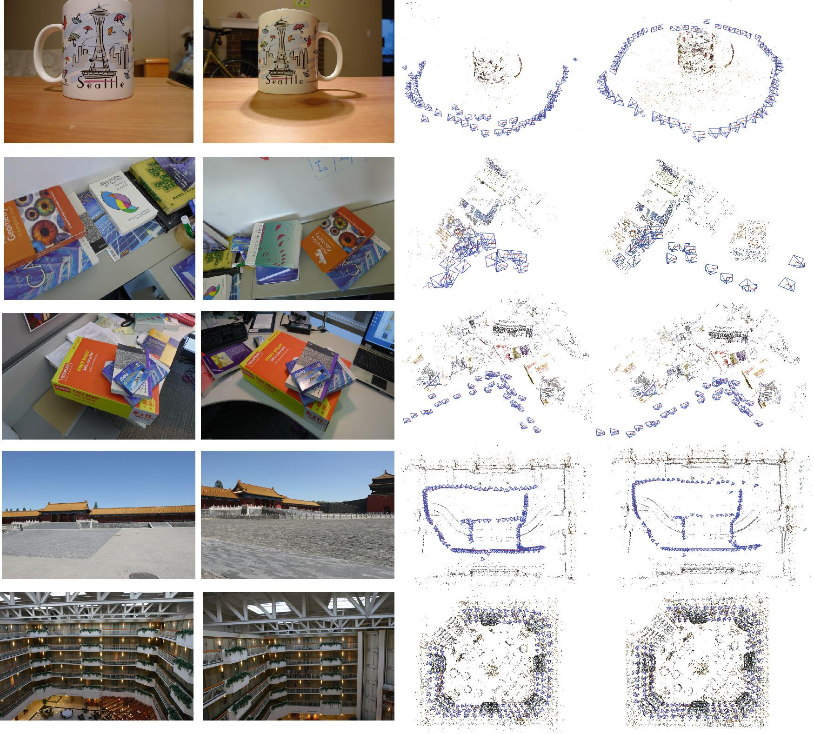


</div>

**COLMAP**
- Books


- Cup

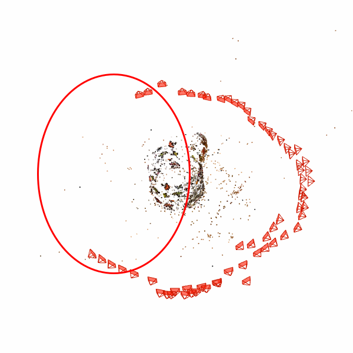

- Desk

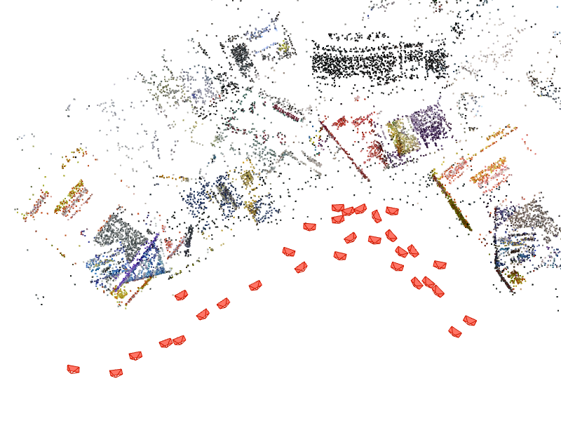

- fc

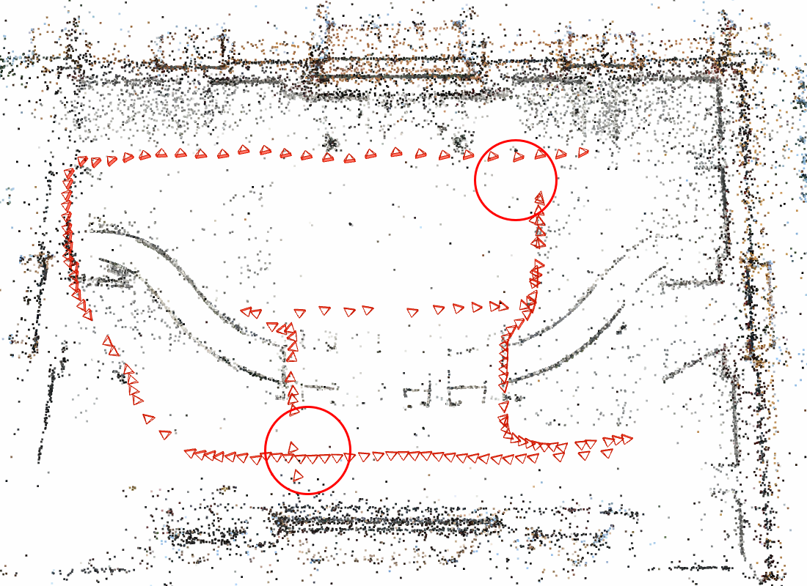

- Indoor

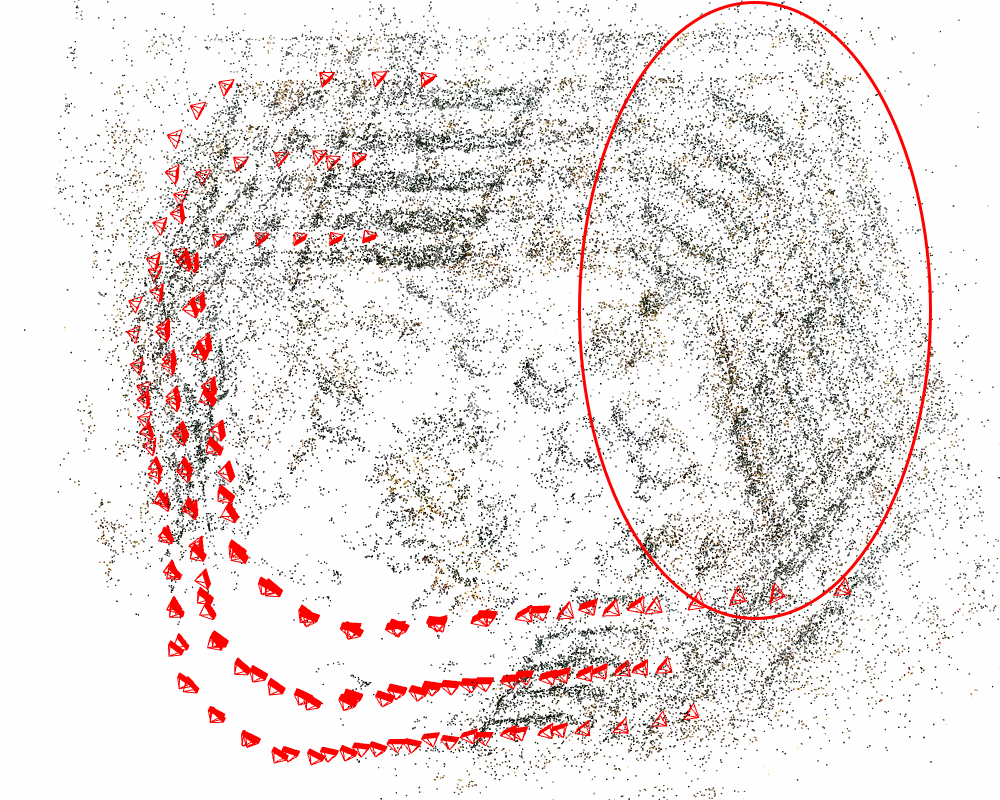

- Street


**OpenMVG**

- Books


**Viewing Graph**


- Cereal

**Viewing Graph**


- Cup

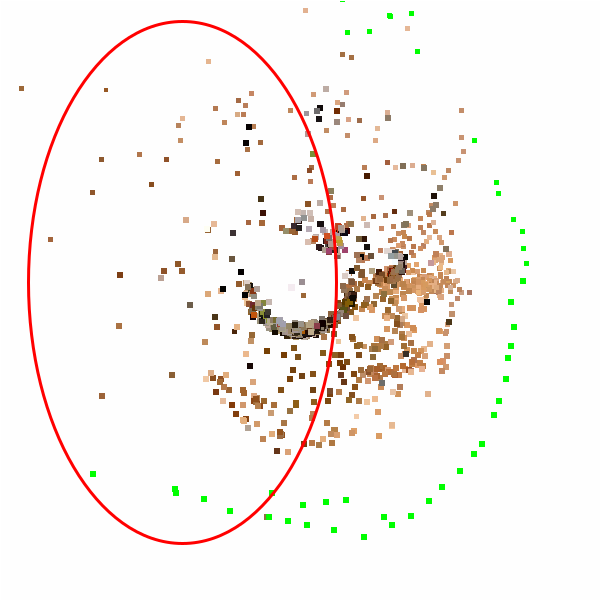

**Viewing Graph**


- Desk

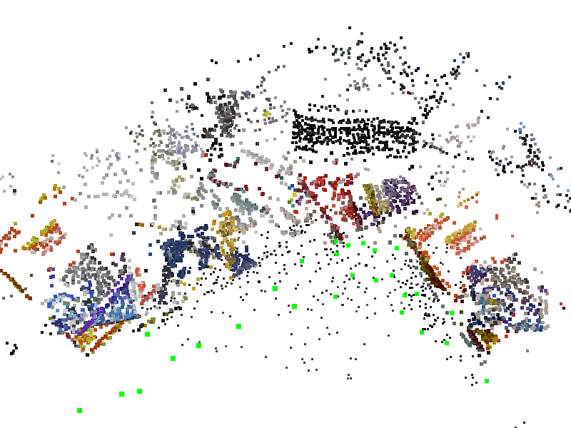

**Viewing Graph**


- fc


**Viewing Graph**


- Indoor


**Viewing Graph**


- Oats

**Viewing Graph**

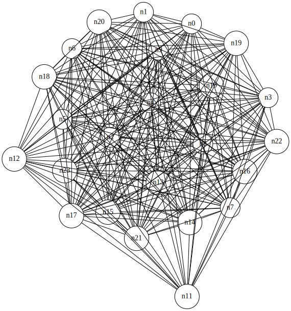

- Street

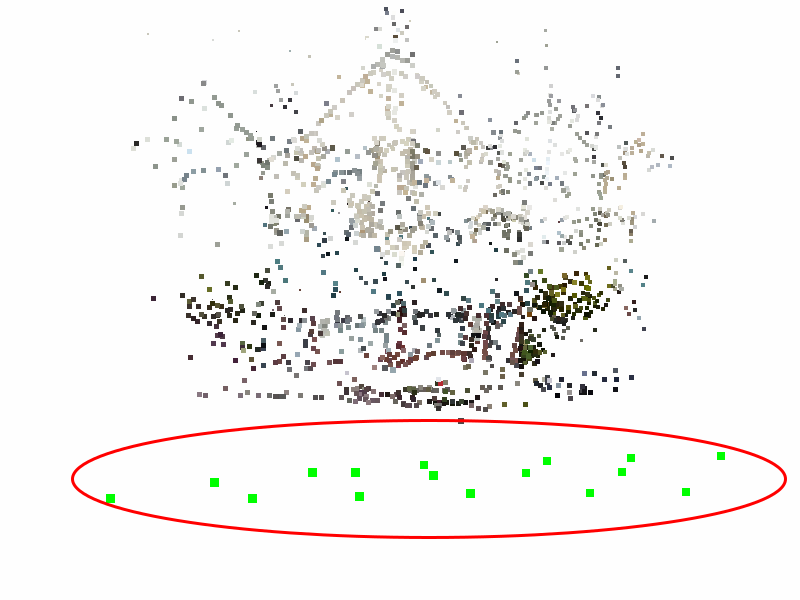

**Viewing Graph**

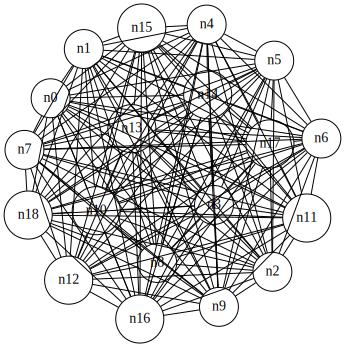

**Ours(with viewing graph)**

- Books

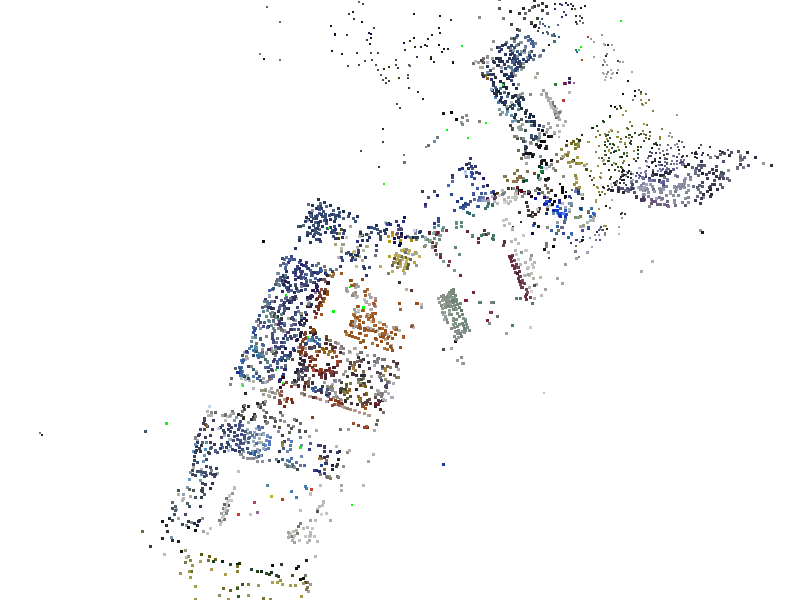

**MST**


**Triplet Expansion**


**Graph Reinforcement**

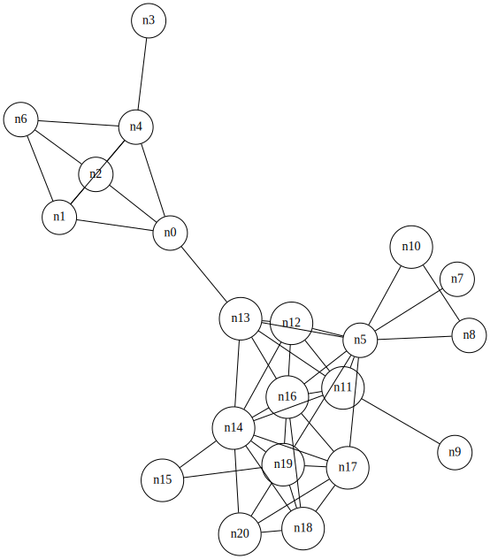

- Cereal


**MST**


**Triplet Expansion**


**Graph Reinforcement**


- Desk

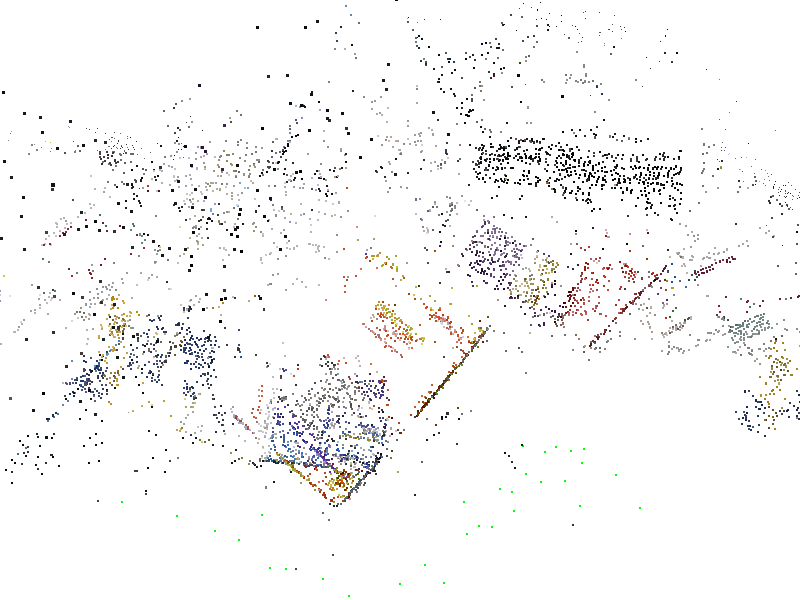

**MST**


**Triplet Expansion**

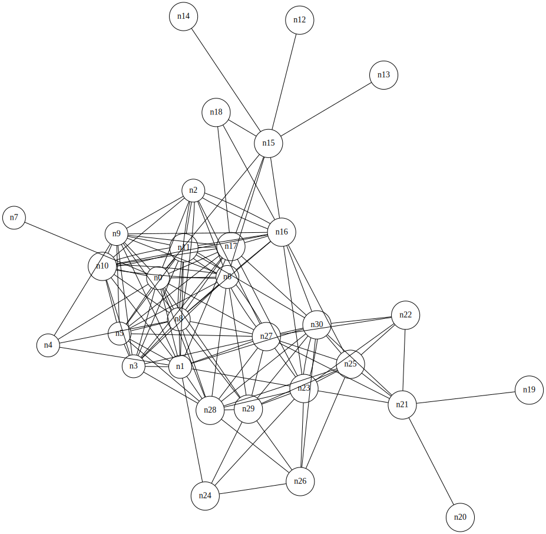

**Graph Reinforcement**


- fc

**Triplet Expansion**


**Graph Reinforcement**


- Oats


**MST**


**Triplet Expansion**


**Graph Reinforcement**

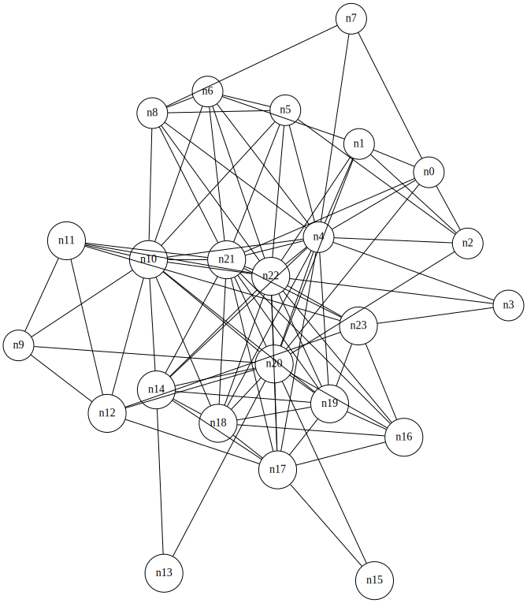

- Street


**MST**


**Triplet Expansion**

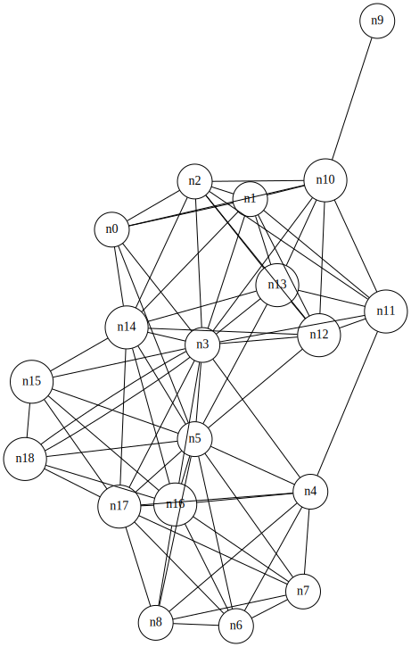

**Graph Reinforcement**

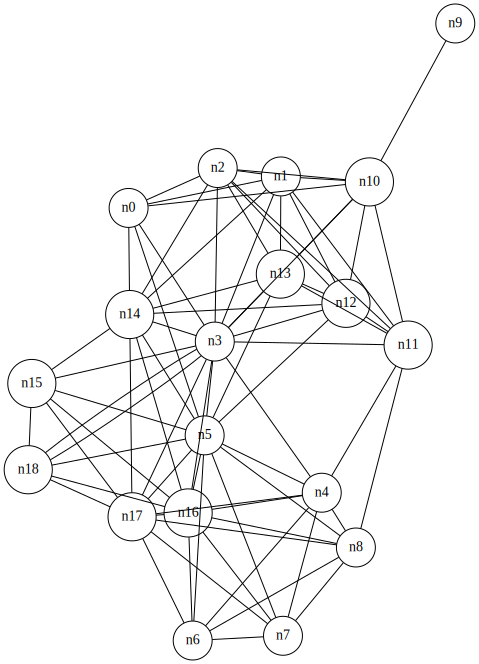


